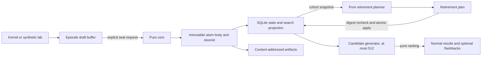

# Architecture

## Scope

NAOME Memory v0.1 is a local, deterministic Rust library and CLI. It accepts explicit episode events, seals immutable memory atoms, plans retirement from short-term memory (STM), atomically applies a verified plan, and ranks retrieval candidates. It does not write to kernel authority. A future kernel integration may call the library through an explicit shadow contract after independently validating its receipt.

The immutable domain layer and mutable persistence layer are intentionally separate:



## Workspace boundaries

- `naome-memory-core` owns domain types, fixed-point arithmetic, canonical bytes, IDs, episode sealing, retirement planning, semantic consolidation, the episodic lottery, retrieval ranking, and receipt verification. It performs no I/O.
- `naome-memory-sqlite` owns migrations, SQLite transactions, FTS5 and structured candidate generation, durable mutable state, artifact ingestion, and garbage collection.
- `naome-memory-lab` owns synthetic datasets, a deliberately slow independent reference model, experiment metrics, and proof assembly.
- `naome-memory-cli` parses human or JSON input and delegates to the libraries. It contains no decision policy.
- `xtask` is the single orchestration surface used locally and in GitHub Actions.

Every crate forbids unsafe Rust. Logical results must not depend on the system clock, process-global randomness, host paths, floating point, locale, thread scheduling, or unordered map iteration. Time is passed as `as_of_us`; randomness is passed as a 32-byte seed. Maps that affect logical output are ordered.

## Public pure operations

```rust,ignore
seal_episode(buffer, request, policy) -> SealedEpisodeV1
seal_episode_chain(buffer, request, policy) -> SealedEpisodeChainV1
plan_retirement(snapshot, policy, seed) -> RetirementPlanV1
apply_retirement(repository, plan) -> ProofReceiptV1
rank_retrieval(query, candidates, policy) -> RetrievalResultV1
verify_receipt(receipt, inputs) -> VerifiedReceiptV1
```

`apply_retirement` is expressed at the public contract level above; its core validation and transition are pure, while the SQLite adapter supplies the repository transaction.

## Episode lifecycle

An episode draft is not a memory. Events are appended with contiguous sequence numbers and one stable scope. Sealing validates scope, order, interval, minimum content, artifact closure, and size. Valid boundaries are `GoalCompleted`, `TerminalFailure`, `GoalChanged`, `ContextChanged`, `Checkpoint`, `Handoff`, and `Timeout`.

The sealed body receives a content-derived `AtomId` and never changes. A body
over the 128 KiB target is not silently accepted by `seal_episode`.
`seal_episode_chain` computes each event digest and exact additive body-size
contribution once, then finds a globally complete minimum-length partition in
`O(n log n)` arithmetic work without repeatedly serializing growing prefixes.
Among equally short chains it deterministically chooses the longest earliest
prefix. Every segment must retain substantive evidence unless the episode has
shared outcome or feedback evidence; this prevents greedy partitioning from
stranding an interpretation-only tail. Every atom after the first points to its
immediate predecessor with `continues`; requested `continues` relations are
normalized to this authoritative chain. A single indivisible event, shared
metadata block, or source stream with no complete target-sized partition is
rejected. Later information also creates a new atom connected by `continues`;
it never edits an existing body.
Mutable state stores tier, content status, expiry, supersession, feedback
counters, retrieval counters, and retirement-run membership separately.
The CLI always returns the `sealed-episode-chain-v1` projection, including for
a one-atom chain, and commits every member plus the draft's newest-atom pointer
in one `BEGIN IMMEDIATE` transaction.

## Retirement lifecycle

Retirement is one run per non-empty UTC expiry-day cohort. Planning is allowed
only at or after the start of the following UTC day; once a cohort has an
applied run, inserting another STM atom whose expiry belongs to that day is a
conflict:

1. Read a stable cohort, fully validate each body/hash/lifecycle/artifact closure, and derive its ordered input-set digest. The digest authority is the sorted set of `AtomId`, verified body digest, complete mutable state, integrity status, and exact-package bytes; it does not duplicate every body inside the plan.
2. Compute the pure retirement plan outside the write transaction.
3. Start `BEGIN IMMEDIATE`.
4. Read the cohort again and recompute its digest.
5. If the digest differs, return `stale_plan` and write no partial result.
6. Otherwise validate the complete plan and atomically write semantic atoms and `DerivedFrom` edges, exact-retention pins, forgetting transitions, decisions, an immutable historical post-state, and the receipt.
7. Before commit, rebuild the canonical logical post-state from persisted headers, bodies, complete states, pins, and search-projection presence and require its digest to equal the plan, historical snapshot, and receipt. Retained bodies and projections are re-derived from typed authority; forgotten sources must have no body, search row, FTS row, or live artifact reference.

Applying a committed plan again returns the existing receipt when its plan digest matches. A different plan or seed for the same memory-space/day cohort is a conflict. Later feedback and retrieval counters may advance monotonically; verification compares structural live state with the immutable retirement snapshot instead of rewriting history. Every score-eligible semantic candidate has an ordered selected/skip disposition in the plan, so count-, atom-, and byte-budget effects remain auditable. Empty, still-open, or over-100,000-member cohorts, incomplete artifact closure, unsupported versions, or exceeded budgets fail closed.

## Retrieval

SQLite FTS5 and structured indexes generate no more than 512 candidates inside one `memory_space_id`. Normal search is repository-local unless the caller explicitly requests memory-space-wide search. The pure core computes fixed-point scores and orders ties by ascending `AtomId`.

Spontaneous flashbacks are a separate, opt-in channel. A query must provide a seed and a budget from one to three. Flashbacks are sampled uniformly without replacement from exact episodic LTM, exclude normal result IDs, and are returned separately with `recall_reason=spontaneous` and `generality=single_episode`. The channel is additive: every request still needs an ordinary `k` from one through the policy maximum and at least one non-blank term, topic key, or entity ID. Ranked and spontaneous candidates recorded after the query's explicit `as_of_us` are rejected rather than silently scored or sampled.

## CLI and process contract

With `--json`, a command writes exactly one object conforming to `schemas/cli-response-v1.schema.json` (Draft 2020-12) to stdout. The envelope's `result` member is intentionally unconstrained because different commands return different projections. Independent payload-schema claims apply only to the committed public episode, retirement, retrieval, and receipt-verification schemas listed in the README. `cargo xtask schema-fixtures` constructs deterministic typed instances, executes the corresponding core operations, and CI validates every generated Serde projection. Internal store and CLI administration results remain envelope-bound only. Logs and human diagnostics go only to stderr.

The concrete CLI bindings are:

| Operation | Typed input or result schema |
| --- | --- |
| `episode append --event` | `episode-event-v1.schema.json` input |
| `episode seal --buffer/--request` | `episode-buffer-v1.schema.json` and `seal-episode-request-v1.schema.json` inputs |
| `episode seal` | `sealed-episode-chain-v1.schema.json` result |
| `cycle plan` | `retirement-plan-v1.schema.json` result |
| `cycle apply --plan` | `retirement-plan-v1.schema.json` input; `proof-receipt-v1.schema.json` result |
| `retrieve --query` | `retrieval-query-v1.schema.json` input; `retrieval-result-v1.schema.json` result |
| `verify receipt --inputs` | `receipt-verification-inputs-v1.schema.json` input; `verified-receipt-v1.schema.json` result |

`RetirementSnapshotV1` is a public library/store boundary validated by `retirement-snapshot-v1.schema.json`; it is not emitted directly by a v0.1 CLI command. `db`, `episode create`, `feedback`, `artifact gc`, and `lab` administration results have only the CLI-envelope contract unless a separate schema is named above.

| Exit | Meaning |
| ---: | --- |
| 0 | Successful operation |
| 2 | Invalid input or policy |
| 3 | Integrity failure |
| 4 | Conflict or stale plan |
| 5 | Unknown schema, policy, or receipt version |
| 6 | Experiment completed but its hypothesis was rejected |

## Compatibility boundary

Schemas, policy files, canonical encodings, RNG identifiers, and receipts are explicitly versioned. Readers reject unknown major versions rather than guessing. Runtime policy overrides are not supported. A policy change requires a new committed policy identifier and golden fixtures.
