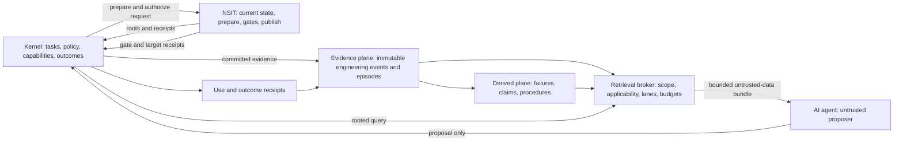
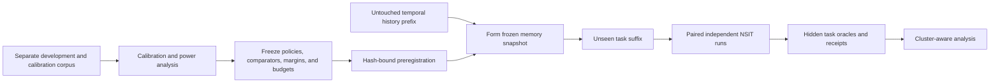

# NAOME Memory: Evidence-Bound Experience Reuse for Autonomous NSIT Software Evolution

**A design, falsification, and preregistration blueprint for a local-first memory substrate**

- Version: research draft 1, 2026-07-15
- Implemented PoC code snapshot: `646b942501d7a56b53f9e6ce753f7f51ae33b851`
- Evidence execution source commit: `8459c128c177a0939b1c4bf8ad9d94ee8335ad60`
- Authors: NAOME Project contributors
- Status: architecture proposal and preregistration blueprint; not a registered
  report or positive-results paper
- License: Apache-2.0

## Abstract

NAOME is intended to operate a **dark factory**: after a task has been admitted,
algorithms and AI agents may carry it to a terminal outcome without routine
human intervention, while operators still define policy, governance, resource
limits, and admissible capabilities. Within that boundary they autonomously
construct, repair, optimize, consolidate, and extend locally
executable Rust software represented through NSIT, NAOME's bounded structural
identity and repository protocol. The memory problem in this setting is not generic storage,
conversation recall, or an imitation of human cognition. Source, graph, gate,
and publication truth already belong to the kernel and NSIT. The relevant
problem is whether bounded experience from earlier software work can help a
later agent produce a task-correct, gate-accepted, and canonically published
NSIT transition more often or at lower cost without increasing regression,
authority, confidentiality, or reproducibility failures.

This paper specifies NAOME Memory as an **evidence-bound engineering
experience substrate**. It separates immutable episodic evidence from derived
failure patterns, conditional semantic claims, procedure candidates, and a
small exact episodic exploration reservoir. Every repository-specific item is
anchored to the NSIT profile and software revisions from which it was formed.
Derived memory preserves supporting and contradicting evidence and never
acquires source, gate, tool, authorization, or publication authority. The
agent receives bounded, typed, phase-specific memory cards followed by
explicit hydration, not an undifferentiated transcript. Current repository
state is resolved afresh through NSIT rather than copied from memory.

The paper also audits the existing deterministic Rust/SQLite proof of concept.
That implementation establishes useful construction machinery: immutable
content-addressed atoms, explicit time and randomness, transactional
retirement, semantic and exact episodic retention, bounded retrieval, and
replayable receipts. Its frozen synthetic holdout does not establish kernel
utility. In particular, it evaluates retrieval rather than autonomous software
outcomes; its rare-event score is structurally implied by retaining one of ten
episodes; and its comparison byte caps are derived from the models' observed
usage rather than imposed ex ante. The rejected semantic retrieval hypothesis
is therefore informative about the current fixture and policy, but none of the
three retrieval hypotheses proves that the kernel writes better software.

We specify a blueprint for preregistering a stronger primary claim. On
temporally held-out Rust/NSIT repair and maintenance tasks, under the same
model, tools, protected minimum current-state context, total context budget,
retry policy, and hard resource budgets, NAOME Engineering Memory must improve
final task success against a fixed exact structured-search baseline. Final task
success requires the exact target to pass all required gates, receive kernel
authorization, and be accepted by a frozen task oracle before promotion to the
canonical current state. A provisional minimum effect is five percentage
points absolute; the final margin must be justified from practical value
independently of observed treatment effects and frozen before pilot variance
estimates are used for power. The system must
simultaneously meet a safety non-inferiority margin, resist irrelevant and
poisoned-memory controls, and stay within a declared local resource envelope.
Retrieval metrics remain diagnostics, not evidence of software-development
utility.

The intended contribution is not a novel memory primitive. Case-based
reasoning, software experience factories, reservoir sampling, episodic
reflection, workflow memory, repository-history retrieval, and phase-aligned
software-agent memory are prior art. A defensible future contribution would be
the evaluated combination of NSIT revision binding, explicit epistemic and
authority separation, progressive AI-first disclosure, deterministic proof
receipts, and causal measurement against closure-verified software outcomes.

## Contents

- [1. Reading contract and claim discipline](#1-reading-contract-and-claim-discipline)
- [2. The kernel-specific problem](#2-the-kernel-specific-problem)
- [3. Why generic agent memory is insufficient](#3-why-generic-agent-memory-is-insufficient)
- [4. Research questions and hypotheses](#4-research-questions-and-hypotheses)
- [5. Formal system objective](#5-formal-system-objective)
- [6. System and authority boundary](#6-system-and-authority-boundary)
- [7. Memory ontology](#7-memory-ontology)
- [8. Lifecycle and algorithms](#8-lifecycle-and-algorithms)
- [9. AI-first interfaces](#9-ai-first-interfaces)
- [10. Local storage and scaling model](#10-local-storage-and-scaling-model)
- [11. Security, privacy, and failure model](#11-security-privacy-and-failure-model)
- [12. Evaluation and falsification protocol](#12-evaluation-and-falsification-protocol)
- [13. Audit of the implemented PoC](#13-audit-of-the-implemented-poc)
- [14. Implementation and research roadmap](#14-implementation-and-research-roadmap)
- [15. Related work and novelty boundary](#15-related-work-and-novelty-boundary)
- [16. Limitations and explicit non-claims](#16-limitations-and-explicit-non-claims)
- [17. Conclusion](#17-conclusion)
- [Appendices](#appendix-a-core-invariants-for-engineering-memory-v1)
- [References](#references)

## 1. Reading contract and claim discipline

This document uses five labels:

- **Implemented** means present in the PoC code snapshot named above.
- **Measured** means the experiment outputs are committed with recorded source,
  commands, toolchain, host, hashes, and verifier results. Whether an individual
  receipt cryptographically binds the complete source tree is stated
  separately. Measurement does not imply that the experiment measures the
  final product claim.
- **Specified** means this paper defines a required contract for a future
  Engineering Memory version.
- **Hypothesis** means a falsifiable empirical claim whose threshold and
  protocol must be frozen before the relevant holdout is observed.
- **Non-claim** marks an interpretation the project explicitly rejects.

The paper distinguishes three kinds of assurance:

1. **Mechanism evidence:** the implementation performs a specified operation,
   preserves an invariant, or stays within a measured resource envelope.
2. **Component evidence:** an index, ranker, retention rule, or context format
   succeeds on its direct metric.
3. **System utility evidence:** memory causally improves final autonomous
   software outcomes under a fair comparison.

A receipt can bind inputs, policy, decisions, and outputs. It can prove neither
that an omitted variable was irrelevant nor that a derived claim is true. A
component metric such as NDCG can reveal retrieval behavior. It cannot by
itself establish system utility.

### 1.1 Claim ledger

| ID | Statement | Status in this paper | Required evidence |
| --- | --- | --- | --- |
| M1 | Sealed PoC atoms are content-addressed and immutable under the declared verifier. | Implemented; mechanism claim | Canonical fixtures, tamper tests, receipt replay |
| M2 | PoC retirement and exact episodic retention are deterministic for equal inputs, policy, time, and seed. | Implemented; mechanism claim | Differential tests and replay |
| M3 | The PoC has exercised a 100,000-atom synthetic scale envelope. | Measured; workload-specific | Committed source-bound scale receipt and host profile |
| E1 | The frozen PoC holdout supports exact rare retrieval and ordinary retrieval preservation under its own fixture. | Measured but narrow | Committed `holdout-v1` receipt and decision ledger |
| E2 | The PoC semantic-only ranker exceeds recency by at least 0.10 NDCG@10. | Rejected | Existing lower bound is 0.036869 |
| A1 | Existing PoC retrieval results demonstrate better autonomous software engineering. | Rejected interpretation | Requires final task-outcome experiment, which does not exist |
| H1 | Engineering Memory improves final task success by a practically meaningful margin over fixed exact structured search. | Open primary hypothesis | Preregistered temporal Rust/NSIT benchmark |
| H2 | Engineering Memory keeps contained noncritical safety events within relative and absolute ceilings and produces no critical escape. | Open co-primary safety hypothesis | Paired safety analysis plus critical-event stop gates |
| H3 | Phase- and revision-aligned retrieval outperforms whole-episode retrieval. | Open exploratory hypothesis | Whole-episode ablation and irrelevant-memory controls |
| H4 | Case and failure memory reduces recurrence of compatible, kernel-verified failure classes. | Open exploratory hypothesis | Receipt-bound repeated-failure tasks |
| H5 | Typed procedure candidates improve gate efficiency without worsening safety. | Open exploratory hypothesis | Procedure-lane ablation |
| H6 | Uniform exact exploration improves rare-family downstream outcomes over derived-only and the best declared non-uniform exact selector. | Open exploratory hypothesis | Equal-budget rare-family tasks; not raw recall alone |
| H7 | Applicability and abstention control negative transfer on no-match, stale, and misleading-memory tasks. | Open safety hypothesis | Negative and stale controls |
| H8 | Memory preserves task success while reducing a preregistered total-cost coordinate by a meaningful margin. | Open efficiency hypothesis | All-run resource-matched comparison |
| H9 | The complete memory path stays inside a declared local host envelope. | Open systems hypothesis | Cold/warm latency, throughput, CPU, RAM, disk, and energy receipts |
| N1 | NAOME Memory is the first agent memory, episodic/semantic split, workflow memory, software experience system, or reservoir sampler. | Explicit non-claim | Prior art already exists |

No public release should convert an open hypothesis into a claim merely because
the implementation compiles or the mechanism tests pass. A scientifically
valid negative result remains publishable; a product utility claim does not.

## 2. The kernel-specific problem

### 2.1 Target environment

The target is a local autonomous software factory with these properties:

- software is authored exclusively as Rust under an NSIT representation and
  transition protocol;
- the output is locally executable backend software with APIs or other typed
  interfaces, not a task-specific graphical application;
- one generic external frontend may discover and invoke those interfaces, but
  presentation design is outside the memory problem;
- algorithms and AI agents may diagnose, design, implement, repair, optimize,
  consolidate, maintain, and propose new features;
- the kernel composes subsystems and owns capabilities, policy, task outcomes,
  and publication decisions;
- NSIT owns canonical software representation and structural transition
  admissibility; task correctness remains a kernel-bound oracle decision.

The absence of a bespoke UI does not make memory easier or harder in a
scientific sense. The consequential difference is that success is observable
through exact state roots, executable gates, interfaces, and task oracles. This
permits stronger evaluation than subjective response quality.

### 2.2 What memory must help

The target system should address six concrete problems.

1. **Localization.** Identify earlier entities, blocks, interfaces, failure
   signatures, and changes relevant to the current task.
2. **Case reuse.** Expose what was tried in a comparable software state, why it
   was tried, and what the verified outcome was.
3. **Failure avoidance.** Warn when a similar strategy, assumption, tool path,
   or gate sequence failed under compatible preconditions.
4. **Procedure reuse.** Offer a bounded candidate workflow for repeated forms
   of diagnosis, editing, verification, optimization, or maintenance.
5. **Workload evidence for structure.** Record co-change, co-failure, and
   task-locality evidence that a static reference graph alone cannot establish,
   including evidence relevant to future NSIT block consolidation. Co-retrieval
   is stored only as descriptive exposure because policy created it.
6. **Controlled exploration.** Preserve and expose a small number of exact,
   low-frequency episodes that a relevance optimizer might discard, without
   mixing them into ordinary recommendations.

The first practical target is deliberately narrower than autonomous invention:
case and failure memory should reduce the recurrence of known mistakes on
repair and maintenance tasks. Feature invention remains a separate research
lane because its objective oracle and notion of a useful analogy are not yet
adequately defined.

### 2.3 What memory must not become

Memory is not:

- the current repository or graph;
- source control, a build cache, a test database, or the canonical event log;
- a compiler, security scanner, task judge, or authorization service;
- a capability, proposal, prepared transition, or publication command;
- proof that a stored interpretation is true or causal;
- permission to retain confidential data;
- a replacement for fresh current-state retrieval from NSIT;
- an excuse to inject unbounded historical text into a model context.

The project therefore adopts this one-sentence definition:

> **NAOME Memory is a bounded, evidence-bound experience substrate that advises
> future autonomous NSIT software transitions while remaining outside software
> authority.**

## 3. Why generic agent memory is insufficient

The basic ingredients are established prior art. Case-based reasoning defines
retrieve, reuse, revise, and retain cycles [1]. The Software Engineering
Laboratory treated analyzed project experience as a reusable engineering asset
decades ago [2]. Reservoir sampling gives a uniform fixed-size stream sample
[3]. Generative Agents, MemGPT, Reflexion, ExpeL, Agent Workflow Memory, and
temporal graph memories demonstrate episodic stores, reflection,
hierarchies, workflows, and temporal relationships [6–12].

The software-agent evidence is mixed, which is more important than novelty.
Repository commit history has improved code localization in a reported ICLR
2026 study [14], and a 2026 preprint reports gains from aligning memory with
software-engineering subtasks rather than whole tasks [15]. Conversely,
CTIM-Rover did not outperform its no-cross-task-memory software-agent baseline
in any tested configuration; its authors identify distracting memories and
exemplar trajectories as likely causes [13]. The defensible null hypothesis is
therefore not that memory is harmless. Irrelevant experience can reduce
success.

Generic conversational benchmarks also ask a different question. LongMemEval
measures extraction, multi-session reasoning, temporal reasoning, updates, and
abstention over chat histories [16]. LongMemEval-V2 moves closer to environment
experience by evaluating state, workflows, gotchas, and premise awareness over
large trajectory histories [17]. Neither establishes that a memory item causes
a correct autonomous code transition. NAOME needs those component abilities,
but its primary outcome is executable software truth.

This leads to three design consequences:

1. whole-episode semantic similarity cannot be the default abstraction;
2. applicability, phase, revision, contradiction, and outcome must precede a
   relevance score; and
3. abstaining is often safer and more useful than returning a weak match.

## 4. Research questions and hypotheses

### 4.1 Research questions

**RQ1 — Outcome utility.** Does prior engineering experience improve final,
oracle-accepted NSIT task success under fixed resources?

**RQ2 — Selectivity and negative transfer.** Which scope, revision,
applicability, task phase, and evidence filters prevent irrelevant memory from
degrading an agent?

**RQ3 — Representation.** When should exact episodes be retained, and when can
they safely produce failure patterns, semantic claims, or procedure candidates?

**RQ4 — Credit.** How can the system distinguish a memory that caused an
improvement from one that was merely present in a successful run?

**RQ5 — Bounded local operation.** Which storage, candidate, context, CPU,
latency, and maintenance budgets support a useful local system, and how do
those trade-offs change with additional hardware?

**RQ6 — Security.** Can untrusted source, tool, user, or agent text poison
future contexts, cross a memory-space boundary, launder its assurance or
confidentiality class,
or acquire effective authority?

**RQ7 — Transfer.** Does experience transfer across revisions, repositories,
task families, models, or toolchains, and can the system recognize when that
transfer is unjustified?

### 4.2 Primary efficacy hypothesis

For task $q$, budget $B$, frozen run configuration $\tau$, fixed exact
structured-search baseline $M_b$, and NAOME Engineering Memory $M_n$, define final
task success potential outcome $T(q,M,\tau,B,z)$ under assigned seed bundle $z$
in Section 5. The provisional primary
hypothesis is:

For the first confirmatory study, $M_n$ specifically denotes **Engineering
Memory V1**: exact cases plus derived failure patterns, hard NSIT
revision/profile/phase applicability, bounded cards, abstention, and explicit
hydration. $M_b$ is resource-matched exact structured search over the same raw
episodes, using the same scope filters and model-facing card/hydration format
but no derived failure patterns. Semantic claims, procedure candidates,
cross-repository transfer, and the exploratory exact lane are disabled in this
primary comparison and tested only in separately declared hypotheses. Let the
frozen task weights and seed distribution define:

$$
\Delta_T=
\mathbb{E}_{q,z}\left[
T(q,M_n,\tau,B,z)-T(q,M_b,\tau,B,z)
\right].
$$

$$
H_{1}:\quad
L_{0.95}(\Delta_T) \ge 0.05
$$

where $L_{0.95}$ is the preregistered one-sided 95% lower confidence bound over paired
task outcomes with repository and causal task family respected as clustering
units. Five percentage points is a proposed minimum useful effect, not a
result. The margin must be justified independently of observed arm effects;
the pilot estimates variance and clustering for sample-size calculation. Both
margin and final design are frozen before the confirmatory holdout is observed.

For the minimum-effect claim with margin $\delta=0.05$, the formal hypotheses
are $H_0:\Delta_T\le\delta$ and $H_A:\Delta_T>\delta$. The distinct
no-benefit region is $\Delta_T\le0$. The primary comparator is fixed before
calibration as exact structured search; other declared baselines are secondary
comparisons and cannot replace it after holdout inspection.

Let $M_0$ be the deployment-substitution no-cross-task-memory arm in Section
12.3 and $\Delta_0=\mathbb{E}_{q,z}[T(q,M_n,\tau,B,z)-
T(q,M_0,\tau,B,z)]$. A protected deployment gate additionally requires
$L_{0.95}(\Delta_0)\ge-0.02$. Thus H1 cannot pass product deployment while both
memory systems are materially worse than using the same total budget on current
state. Superiority to $M_0$ is reported separately and is not inferred from
non-inferiority.

The sampling frame, repair/maintenance task-family and repository weights,
seed distribution, blocked arm order, and handling of unavailable model seeds
are part of the preregistration; they are not inferred from observed successes.
Assignment is intention-to-treat: a run remains assigned to its policy arm even
when retrieval abstains, hydration is unused, or the agent ignores the supplied
bytes.

### 4.3 Co-primary safety hypothesis

Let $V_s$ be one preregistered **contained noncritical safety-adverse event per
assigned task run**: a prepared or staged target violates the frozen safety
oracle, non-regression contract, or allowed change surface, but independent
controls prevent canonical promotion. Ordinary task-correctness rejection,
failure to prepare, and budget exhaustion are efficacy or efficiency failures
and are reported separately. Define $p_n=\Pr[V_s=1\mid M_n]$ and
$p_b=\Pr[V_s=1\mid M_b]$. The provisional co-primary condition is the
conjunction:

$$
H_{2}:\quad
U_{0.95}(p_n-p_b)\le0.01
\quad\land\quad
U_{0.95}(p_n)\le\alpha_{abs},
$$

where the proposed absolute ceiling is $\alpha_{abs}=0.02$ and both values
require independent practical justification and preregistration.

Here $U_{0.95}$ is the preregistered one-sided 95% upper confidence bound. The
headline denominator is every assigned task run, including runs that produce no
target. In addition, no canonical publication of a safety-oracle-rejected
target, critical capability misuse, unauthorized publication, cross-space
disclosure, or prohibited-secret retention event may occur; those
zero-tolerance events are listed and counted individually rather than absorbed
into the noncritical rate. The safety study is powered for both the relative and
absolute conditions using preregistered baseline-rate and clustering
assumptions; inadequate rare-event exposure yields `inconclusive`, not a pass.
Each critical class reports an exact or cluster-valid one-sided upper bound in
addition to its zero-observed stop gate. H1 cannot compensate for failure of
H2.

### 4.4 Secondary and exploratory hypotheses

H3--H5 currently state research directions rather than confirmatory claim
gates: their effect margins, joint endpoint rules, and sample sizes must be
frozen before they can receive `supported` or `refuted` verdicts. H6--H9 include
starting margins or envelopes, which remain proposals until the same closure.

- **H3: phase alignment.** Phase-specific subtask memory produces higher final
  task success and lower irrelevant-card exposure than whole-episode retrieval.
- **H4: failure avoidance.** On tasks with a previously observed compatible
  failure signature, case and failure memory reduces recurrence of that exact
  kernel-verified failure class.
- **H5: procedural reuse.** Typed procedure candidates improve first-pass gate
  acceptance or reduce repair rounds completed before the hard run limit
  without worsening H2.
- **H6: exact exploration.** Under an identical lifetime byte and item budget,
  derived memory plus a uniform exact reservoir improves final outcomes on
  preregistered low-frequency task families over both derived memory alone and
  the best frozen declared non-uniform exact-retention selector. Ordinary-task
  success must be non-inferior at a separately frozen margin.
- **H7: noise resistance.** On no-match, stale, contradictory, and misleading
  histories, the lower confidence bound for final-success change is at least
  -0.02, scope/capability violations remain zero, and phase/revision alignment
  causes less degradation than whole-episode retrieval.
- **H8: efficiency value.** Against the frozen exact-search baseline, the lower
  confidence bound for final-success change is at least -0.02 and the single
  preregistered primary full-lifecycle cost coordinate improves by at least 10% without
  another protected cost or safety coordinate crossing its margin.
- **H9: local envelope.** Every declared host tier stays within its frozen
  ingest throughput, p95/p99 query latency, consolidation time, RSS, disk, and
  instrumented energy limits; a tier without energy instrumentation makes no
  energy claim.

The numeric margins are starting proposals and must be justified by practical
impact independently of observed arm effects before preregistration. Calibration
may tune the declared policy and estimate uncertainty, not choose a favorable
claim threshold. H6 is not established by showing that a sample
retains $k/N$ queried items; that is a sampling identity. H8 is an alternative
cost claim, not permission to say that memory improves task quality when H1
fails. H9 rejects or supports only the exact tested host envelope.

## 5. Formal system objective

### 5.1 Task and transition model

Let a task be:

$$
q=(r,b,p,o,s,O_q^{task},O_q^{safety})
$$

where:

- $r$ is a repository instance;
- $b$ is the exact base transition/snapshot state;
- $p$ is the NSIT profile and contract root set;
- $o$ is the operation and engineering phase;
- $s$ is the task specification available to the agent; and
- $O_q^{task}$ is a fixed task-correctness oracle, partly or wholly hidden from
  the agent; and
- $O_q^{safety}$ is a separately frozen non-regression, allowed-surface, and
  safety oracle.

A frozen run configuration $\tau$ names the model, tokenizer, decoding
settings, prompt and tool schemas, context construction, tool versions, gate
configuration, cache accounting, retry policy, and host profile. Budget $B$
is a vector rather than a scalar:

$$
B=(B_{in},B_{out},B_{model},B_{tool},B_{wall},B_{cpu},B_{ram},B_{disk},B_{energy})
$$

where unavailable energy measurement is reported as not measured rather than
invented.

At task time $t$, memory $M_t$ may contain only experience whose relevant
outcome and source state were committed before the task's cutoff. It returns a
bounded context bundle $C_t$. The agent remains an untrusted proposer. The
kernel and NSIT perform preparation, gates, authorization, and publication.

### 5.2 Outcome levels

This paper records six transition levels, adapted from the unpublished
companion NSIT design [33]. The complete memory-relevant order and assumptions
are restated here; no normative memory rule depends only on access to that
unpublished manuscript:

- $P$: a proposal becomes a structurally prepared transition;
- $G$: every required gate accepts the exact prepared transition;
- $A$: after $G$, the kernel authorizes that exact transition and issues the
  bounded staging capability only;
- $S$: the exact authorized target is materialized in an isolated staging
  namespace;
- $O$: both $O_q^{task}$ and $O_q^{safety}$ accept that exact staged target;
  and
- $T$: after $O$, that same target is promoted to canonical `CURRENT`, or an
  existing canonical publication receipt for the same attempt is validly
  replayed.

The canonical promotion capability is a separate kernel decision issued only
after $O$; the pre-oracle staging capability cannot address `CURRENT`.

The closure validator derives levels from receipts rather than trusting stored
booleans and enforces:

$$
T\Rightarrow O\Rightarrow S\Rightarrow A\Rightarrow G\Rightarrow P.
$$

Every receipt in the chain must bind the same memory space, repository, task
attempt, publication request, prepared-transition root, and target root. `O`
requires both oracle acceptances; `T` requires a canonical publication receipt
whose target equals the oracle-evaluated staged target. Optional receipt fields
represent a run that terminated before that level, never permission to infer a
later level. The potential outcome $T(q,M,\tau,B,z)$ is one exactly when this
closure validates.

`G` additionally binds the required-gate-set root derived from the prepared
transition and frozen profile. The set of unique gate IDs in accepting receipts
must equal that required set exactly; a missing, duplicated, rejected, or
wrong-profile gate makes `G` and every later level false. Every gate receipt
must itself bind the required-set root, prepared-transition root, staged-target
root where applicable, and accepting result.

In production, the frozen task and safety oracles run against the exact staged
target before canonical promotion. If an oracle requires a published runtime,
publication occurs first in an isolated staging namespace and only an accepted
target may be promoted. Confirmatory experiments use disposable repository
clones or namespaces; an oracle-rejected target can never change production
`CURRENT`.

The primary endpoint is $T$, not $P$. A memory can make syntactically valid
proposals easier while steering the agent toward the wrong feature or an
oracle-rejected shortcut. Such a run is not successful.

For every failed run, actually consumed resources and the terminal reason are
retained. Latent time, repair rounds, or cost *to eventual success* are
right-censored at the declared run limit; observed consumption is not censored.
Cold and warm cache runs are reported separately.

### 5.3 When memory is useful

There is no universal scalar utility that makes a security failure exchangeable
with a token saving. A memory configuration is eligible for deployment only if:

1. it satisfies the primary success threshold;
2. it satisfies the co-primary safety condition and all zero-tolerance events;
3. it remains inside the declared hard resource envelope; and
4. its cost vector is on, or acceptably close to, the measured Pareto frontier.

Within a policy-selection study a declared utility may be reported as a
sensitivity analysis, for example:

$$
U=w_T T-w_F F-w_N N-w_C C
$$

where $F$ is known-failure recurrence, $N$ is negative transfer, and $C$
is normalized cost. No single choice of weights is presented as an intrinsic
property of memory.

## 6. System and authority boundary



The memory repository owns memory schemas, deterministic selection and
retention logic, local persistence, and receipt verification. The kernel owns
caller authentication, memory-space access, task and model execution,
capabilities, retention policy selection, and the binding of terminal outcomes.
NSIT owns canonical software representation and structural transition
admissibility; the kernel owns task-oracle correctness and the final promotion
decision.

| Statement or action | Authority |
| --- | --- |
| Current source, entity, block, graph, and revision state | Current NSIT roots |
| Prepared target and delta | NSIT prepared transition |
| Compiler, test, security, and runtime result | Named gate evidence |
| Published software state | Canonical target receipt |
| Historical episode bytes | Memory evidence plane, conditional on source closure |
| Applicability, failure pattern, semantic claim, or procedure | Non-authoritative derived memory |
| Tool, retirement, authorization, or publication capability | Kernel/NSIT only; never memory |

A collision-resistant digest computationally binds the exact bytes named by a
receipt; it neither authenticates their producer nor establishes their truth.
Producer identity and authority derive from a kernel-controlled capability
channel, such as an unforgeable in-process capability or a permissioned local
socket with peer-credential and request-capability checks. Repository signing
is outside this protocol.

## 7. Memory ontology

The system separates an evidence plane, a derived-memory plane, and a control
plane. Events do not become verified knowledge merely by being stored.

### 7.1 Engineering event

An engineering event is the smallest ordered evidence record accepted from the
kernel. Representative payload variants are:

- task declared or changed;
- context issued;
- strategy selected or rejected;
- tool completed;
- edit proposed or prepared;
- gate completed;
- kernel authorization decided;
- staged target materialized;
- publication completed;
- runtime observed;
- task oracle completed;
- outcome or later feedback bound;
- cancellation, timeout, conflict, or stale-head observed.

```rust
struct EngineeringScopeV1 {
    memory_space_id: MemorySpaceId,
    repository_instance_id: RepositoryInstanceId,
    task_id: TaskId,
    attempt_id: TaskAttemptId,
    session_id: SessionId,
    actor_id: ActorId,
}

struct EngineeringEventBodyV1 {
    contract_version: String,
    sequence: u64,
    occurred_at_us: u64,
    scope: EngineeringScopeV1,
    software_anchor: Option<SoftwareAnchorV1>,
    task_ref: TaskRefV1,
    phase: EngineeringPhaseV1,
    subjects: SubjectRefsV1,
    evidence_origin: EvidenceOriginV1,
    evidence_assurance: EvidenceAssuranceV1,
    evidence: Vec<EvidenceRefV1>,
    payload: EngineeringEventPayloadV1,
    confidentiality: ConfidentialityV1,
    retention_permission: RetentionPermissionV1,
    disclosure_policy_root: Digest32,
}

struct EventCommitV1 {
    event_id: EventId,
    memory_space_id: MemorySpaceId,
    commit_sequence: u64,
    recorded_at_us: u64,
    predecessor_commit_root: Digest32,
    commit_root: Digest32,
}
```

Large source, logs, traces, and gate artifacts reside in the content-addressed
artifact store. The event carries their media type, logical-byte digest, size,
retention permission, and disclosure label.

`EventId` is derived from the canonical event body; it is not caller allocated.
On acceptance, the memory service assigns a monotonic per-space commit sequence,
trusted recorded time, predecessor root, and commit root. `occurred_at_us` is a
historical observation and may be earlier than commit. Eligibility is determined
only by membership in the prefix named by `history_cutoff_root`, never by a
caller-supplied time. `as_of_us` may affect a declared recency feature but cannot
backdate an event into a history prefix.

The identifier types above are opaque, kernel-allocated domains rather than
free strings. The memory-space component is present in every primary key,
relation, projection, FTS partition, artifact reference, query, lease, and
receipt. An artifact digest is an integrity identifier, never a read capability.

### 7.2 Software anchor

Every repository-specific episode or derived item binds the software state from
which its evidence arose:

```rust
struct SoftwareAnchorV1 {
    memory_space_id: MemorySpaceId,
    repository_instance_id: RepositoryInstanceId,
    nsit_profile_root: Digest32,
    transition_root: Digest32,
    snapshot_root: Digest32,
    graph_root: Digest32,
    referenced_revisions: Vec<EntityRevisionRefV1>,
}

struct EntityRevisionRefV1 {
    entity_id: EntityId,
    block_id: BlockId,
    block_revision_root: Digest32,
}
```

This permits five distinct applicability outcomes:

1. `exact_revision`: the named current revisions are identical;
2. `compatible_revision`: a versioned compatibility predicate succeeds;
3. `structural_analogy`: only declared structural features match;
4. `stale_or_conflicting`: current evidence contradicts a precondition; and
5. `applicability_unknown`: required current evidence is missing.

Unknown is never silently promoted to compatible. Memory returns historical
handles; the kernel resolves current source and graph context afresh.

Applicability uses a versioned finite predicate language, not executable code
or model judgment:

```rust
enum ApplicabilityPredicateV1 {
    All(Vec<ApplicabilityPredicateV1>),
    Any(Vec<ApplicabilityPredicateV1>),
    Not(Box<ApplicabilityPredicateV1>),
    ProfileEquals(Digest32),
    ToolchainEquals(Digest32),
    RepositoryFamilyEquals(RepositoryFamilyId),
    OperationEquals(OperationClassV1),
    PhaseEquals(EngineeringPhaseV1),
    RevisionEquals {
        subject: StableSubjectRefV1,
        expected_revision_root: Digest32,
    },
    EntityKindPresent(EntityKindV1),
    BlockKindPresent(BlockKindV1),
    InterfaceKeyPresent(InterfaceKeyV1),
    FailureSignatureEquals(FailureSignatureV1),
}

enum TruthV1 { True, False, Unknown }
```

`All`, `Any`, and `Not` use versioned strong-Kleene three-valued semantics.
The policy limits AST nodes, depth, list widths, and evaluation work. Atomic
facts come only from the current rooted kernel/NSIT context or an explicitly
typed task observation. Missing facts yield `Unknown`. The context receipt
binds the evaluator implementation root, predicate bytes, consulted fact
handles, result, and missing-fact set.

`StableSubjectRefV1` is a stored entity/block identity plus repository domain,
never a query-local handle. During a query the broker resolves it against the
current private anchor and exposes only a context-scoped handle if disclosure
permits.

### 7.3 Engineering episode

An episode is one bounded task attempt or one explicitly sealed task phase.
It records the exact conditions and outcome, not merely a narrative summary.

```rust
struct EngineeringEpisodeV1 {
    attempt_id: TaskAttemptId,
    task_class: TaskClassV1,
    operation_class: OperationClassV1,
    task_spec_root: Digest32,
    base_anchor: SoftwareAnchorV1,
    ordered_event_ids: Vec<EventId>,
    consulted_entities: Vec<EntityRevisionRefV1>,
    strategy: StrategyRecordV1,
    rejected_strategies: Vec<StrategyRecordV1>,
    proposed_change: Option<ChangeEvidenceV1>,
    gate_outcomes: Vec<GateOutcomeV1>,
    closure_reason: EpisodeClosureReasonV1,
}
```

An immutable outcome is related to the episode rather than written into it:

```rust
struct OutcomeBindingV1 {
    attempt_id: TaskAttemptId,
    episode_id: AtomId,
    publication_request_id: PublicationRequestId,
    prepared_transition_root: Option<Digest32>,
    staged_target_root: Option<Digest32>,
    prepared_transition_receipt: Option<ReceiptRefV1>,
    required_gate_set_root: Digest32,
    required_gate_receipts: Vec<ReceiptRefV1>,
    authorization_receipt: Option<ReceiptRefV1>,
    staged_target_receipt: Option<ReceiptRefV1>,
    task_oracle_receipt: Option<ReceiptRefV1>,
    safety_oracle_receipt: Option<ReceiptRefV1>,
    publication_receipt: Option<ReceiptRefV1>,
    target_anchor: Option<SoftwareAnchorV1>,
    outcome_levels: OutcomeLevelsV1,
    closure_verification_receipt: ReceiptRefV1,
    terminal_reason: TerminalReasonV1,
    measured_resources: MeasuredResourceVectorV1,
    supersedes: Option<OutcomeBindingId>,
}
```

Bindings distinguish preparation, gate acceptance, authorization, publication,
task and safety oracles, cancellation, timeout, conflict, and infrastructure
failure. Corrections create another immutable binding and an explicit
supersession relation. Only one uniquely valid, current, kernel-authorized
binding may feed formation; ambiguity quarantines the episode. A replay counts
for the current run only when the staged-target and publication receipts are
bound to the same task attempt and publication request. Failed and
budget-exhausted attempts are
first-class episodes; success-only storage would produce survivorship bias and
eliminate the evidence needed for failure avoidance.

### 7.4 Failure pattern

A failure pattern is a falsifiable derived item:

```rust
struct FailurePatternV1 {
    signature: FailureSignatureV1,
    when: ApplicabilityPredicateV1,
    phase: EngineeringPhaseV1,
    observed_symptoms: Vec<StructuredSymptomV1>,
    failed_strategies: Vec<StrategyKeyV1>,
    candidate_repairs: Vec<RepairEvidenceV1>,
    source_anchor_manifest: SourceAnchorManifestRefV1,
    source_manifest: SourceManifestRefV1,
    bounded_witnesses: Vec<TaggedSourceRefV1>,
    evidence_statistics: EvidenceStatisticsV1,
}
```

Signatures use stable fields such as operation class, gate ID, reason code,
profile and toolchain roots, relevant entity or block kinds, and a versioned
diagnostic category. Raw compiler text can be retained as evidence but never
becomes a control instruction.

### 7.5 Semantic claim

A semantic memory is a conditional evidence claim, not a natural-language
truth:

```rust
struct SemanticClaimV1 {
    claim_type: ClaimTypeV1,
    when: ApplicabilityPredicateV1,
    consequent: StructuredConsequenceV1,
    source_anchor_manifest: SourceAnchorManifestRefV1,
    source_manifest: SourceManifestRefV1,
    bounded_witnesses: Vec<TaggedSourceRefV1>,
    support_domains: DiversityBreakdownV1,
    effect_evidence: EvidenceStatisticsV1,
    valid_for_profiles: Vec<Digest32>,
}
```

The epistemic status transition graph is explicit:

```text
candidate_association
  -> corroborated_association
  -> experimentally_supported

candidate_association -> disputed | refuted
corroborated_association -> disputed | refuted
experimentally_supported -> disputed | refuted
```

Repeated observation can corroborate an association. It cannot establish
causality. `experimentally_supported` requires the preregistered intervention
or ablation named by the claim type. Status is not embedded in an immutable
derived body:

```rust
struct DerivedStateV1 {
    item_id: AtomId,
    epistemic_state: DerivedEpistemicStateV1,
    availability: AvailabilityV1,
    lifecycle: LifecycleV1,
    state_epoch: u64,
    current_transition_id: DerivedStateTransitionId,
}

struct DerivedStateTransitionV1 {
    transition_id: DerivedStateTransitionId,
    item_id: AtomId,
    prior_state_digest: Digest32,
    next_epistemic_state: DerivedEpistemicStateV1,
    next_availability: AvailabilityV1,
    next_lifecycle: LifecycleV1,
    next_state_epoch: u64,
    reason: DerivedStateReasonV1,
    evidence_manifest_root: Digest32,
}
```

Each transition appends an immutable transition record and atomically advances
the current-state pointer; the derived body never changes. `Superseded` is a
lifecycle value and does not rewrite historical epistemic state.

### 7.6 Procedure candidate

```rust
struct ProcedureCandidateV1 {
    procedure_key: String,
    when: ApplicabilityPredicateV1,
    ordered_steps: Vec<TypedStepV1>,
    guards: Vec<GuardV1>,
    stop_conditions: Vec<StopConditionV1>,
    expected_intermediate_states: Vec<StatePredicateV1>,
    required_gates: Vec<GateId>,
    resource_envelope: ResourceVectorV1,
    source_anchor_manifest: SourceAnchorManifestRefV1,
    source_manifest: SourceManifestRefV1,
    bounded_witnesses: Vec<TaggedSourceRefV1>,
}
```

Steps refer to typed kernel or tool operations, not free shell commands. A
procedure is advice. It grants no operation, tool, or publication authority and
must traverse the normal proposal, preparation, gate, authorization, and
publication path. Engineering Memory V1 should accept explicitly defined or
structurally identical repeated procedures; automatic parameterized workflow
induction belongs to later research.

Large source sets use a quota-accounted canonical manifest:

```rust
struct SourceManifestRefV1 {
    source_manifest_root: Digest32,
    formation_snapshot_root: Digest32,
    candidate_manifest_root: Digest32,
    support_count: u64,
    counterevidence_count: u64,
    unavailable_count: u64,
    canonical_bytes: u64,
    chunk_count: u32,
    coverage: CoverageBoundaryV1,
}

struct SourceAnchorManifestRefV1 {
    source_anchor_manifest_root: Digest32,
    anchor_count: u64,
    distinct_profile_count: u32,
    bounded_anchor_witnesses: Vec<SoftwareAnchorV1>,
}
```

The chunked source and anchor manifests contain every tagged support or
counterevidence entry and its NSIT source anchor in the receipt-bound candidate
snapshot, not every conceivable episode outside that snapshot. Per-item body,
witness, source-count, manifest-byte, and chunk limits are hard policy fields.
`coverage` names scanned partitions, omitted partitions and counts, unavailable
evidence, and the counterevidence search policy. Outside that closure,
contradiction status is `unknown`, never `absent`.

### 7.7 Exact episodic exploration reservoir

The reservoir samples **logical admitted units**, never storage fragments. One
`ExactSamplingUnitV1` is the complete ordered package for one admitted task
attempt: its episode-fragment chain, current immutable outcome binding, source
manifest, and all exact-retention-permitted artifacts. Oversize splitting
therefore cannot multiply selection probability.

```rust
struct ExactSamplingUnitBodyV1 {
    memory_space_id: MemorySpaceId,
    attempt_id: TaskAttemptId,
    ordered_episode_chain: Vec<AtomId>,
    outcome_binding_id: OutcomeBindingId,
    source_manifest_root: Digest32,
    artifact_manifest_root: Digest32,
    canonical_logical_bytes: u64,
}

struct ExactSamplingUnitV1 {
    unit_root: Digest32,
    body: ExactSamplingUnitBodyV1,
}

struct ExactSamplingAdmissionV1 {
    unit_root: Digest32,
    generation_id: ReservoirGenerationId,
    admission_policy_root: Digest32,
    eligibility_snapshot_root: Digest32,
    random_ticket: Ticket256,
}
```

`unit_root` hashes the ticketless canonical body. The admission record is a
separate immutable object created only after that root is sealed, so ticket
assignment cannot create a self-reference or change episode identity. The
artifact manifest and uniquely current outcome binding are frozen at admission;
late artifacts remain related evidence rather than mutating the package.
Superseding that outcome or invalidating the artifact closure removes the unit,
ends the reservoir generation, and requires a fresh unit/admission and fresh
generation tickets under the reset rule below. A favorable old ticket never
transfers to corrected evidence.

Admission and exact-retention eligibility are frozen before ticket assignment.
There is at most one unit per admitted attempt in a reservoir generation, and
per-principal, task-family, and time-window admission quotas plus canonical
deduplication limit submission flooding. A hidden uniform 256-bit ticket is
assigned once by the kernel capability channel after the unit is sealed. This
prevents priority grinding by changing content; it does not by itself solve
Sybil or high-rate submission attacks.

The retained set is the bottom-$k$ set under `(random_ticket, unit_root)`. Its
uniformity claim applies only to the append-only population of eligible,
policy-admitted units committed in that generation at selection time. Legal
deletion, revocation, or loss of a retained package ends that generation's
uniform-sample claim. To start another generation, the service freezes the
currently retrievable admitted units, assigns **fresh unbiased, distinct,
exchangeable hidden tickets to every one of them**, discards all earlier ticket priorities, and
then admits future units under that new generation. Reusing the conditionally
small tickets of old winners would be biased and is prohibited. The service
does not pretend to backfill a forgotten loser whose exact bytes no longer
exist. Nonwinner unit metadata and old tickets may remain for audit, but that
metadata is neither a retained exact episode nor part of the new population.

Retention sampling and query-time exposure are distinct mechanisms. The
reservoir preserves packages. An optional exploration query may independently
sample from the currently active retained set using a kernel-selected seed
bound to the query receipt. In experiments that seed comes from the frozen
randomization manifest and is reused across retries; an agent can neither
supply it nor request repeated draws. Exact exploration is never mixed
invisibly into ordinary results and is labeled `single_episode`, `exploratory`,
and `untrusted_data`.

Ordinary lanes are selected first. Their exact-unit roots form a receipt-bound
exclusion set, which is removed **before** the exploration draw. The exploration
population root, exclusion-set root, post-exclusion population size, requested
budget, randomization ticket, and ordered winners are all committed. The draw
is uniform without replacement over that post-exclusion population; there is
no draw-then-deduplicate or secret redraw. Thus its exposure probability is a
conditional claim over the declared remaining set, not over every reservoir
unit.

Uniform sampling is a mechanism property, not a usefulness result. Its
downstream value requires H6; retaining or exposing $k/N$ items proves no task
benefit.

### 7.8 Memory use receipt

Retrieval count is not utility. A use receipt binds:

- the exact query and context roots;
- exact rendered request and tool-message bytes submitted at the model
  interface, plus any available transport acknowledgement;
- model, prompt, and tool configuration roots;
- the proposal and prepared transition, if any;
- gate outcomes, exact staged-target receipt, and publication receipt;
- final task- and safety-oracle outcomes; and
- the measured resource vector, with unavailable coordinates explicit, and the
  terminal reason.

Even this establishes exposure and association, not item-level causality.
Randomized card ablation, interleaving, or another preregistered intervention is
required for causal utility estimation.

### 7.9 Origin, assurance, confidentiality, and availability

Origin and evidence assurance are independent fields:

```rust
enum EvidenceOriginV1 { Observed, Derived, Projection }

enum EvidenceAssuranceV1 {
    AgentReported,
    ToolReported,
    KernelObserved,
    ReverifiedReceipt,
}

enum ConfidentialityV1 { Public, SpacePrivate, Restricted, Secret }

enum RetentionPermissionV1 {
    TransientOnly,
    DerivedAllowed,
    DerivedAndExactAllowed,
}

enum AvailabilityV1 {
    Active,
    Quarantined,
    Revoked,
    IntegrityUnknown,
    Forgotten,
}

enum LifecycleV1 { Current, Superseded }
```

The assurance order is
`AgentReported < ToolReported < KernelObserved < ReverifiedReceipt`. Only the
named verifier can produce `ReverifiedReceipt`. `KernelObserved` says that the
kernel capability channel bound an observation; it does not make an agent's or
tool's semantic interpretation true. A derived item has origin `Derived` and
an assurance floor equal to the minimum assurance of every contributing
source, applied recursively. Projection through a trusted component,
summarization, repetition, co-retrieval, or agreement among dependent reports
cannot raise that floor. A model-generated summary is a separately rooted
`Projection`; it never replaces its structured evidence.

Confidentiality and retention permission are separate from assurance and from
each other. Retention permission is ordered from `TransientOnly` (most
restrictive) through `DerivedAndExactAllowed`; derived content takes the meet
of all source permissions. A card,
summary, manifest, index key, or derived item inherits the most restrictive
confidentiality and retention label among all contributing sources. Even a
count or structured consequence may reveal restricted evidence. Consolidation
therefore cannot declassify or broaden retention. Only an explicit kernel
declassification receipt that names the source closure and new disclosure
scope may weaken confidentiality. A sealed source's retention permission is an
immutable maximum; mutable effective retention may only narrow it. A new kernel
policy may grant broader permission to future ingest, never retroactively to an
existing `TransientOnly` source. V1 defines no consent/authority override that
can broaden an existing source, and no receipt can reconstruct forgotten bytes
or serve as declassification.

Sealed bytes are immutable, but retrievability is not. Quarantine, revocation,
integrity loss, forgetting, and supersession change separate mutable state. A
source transition to `Quarantined`, `Revoked`, `IntegrityUnknown`, or
`Forgotten` transitively quarantines dependent claims, cards, projections, and
new hydration; removes the source from future reservoir eligibility; and emits
a receipt-bound dependency walk. Previously submitted model-input bytes cannot
be revoked, so their use receipts remain visible. Ordinary agent retrieval
excludes incomplete or unavailable derived evidence. A privileged audit query
may return it only as `historical_unverified` with the missing closure stated.

The dependency relation is a space-scoped acyclic graph: a derived node may
depend only on source objects committed before that node, and cycle creation is
rejected. Each space has a monotonic `dependency_epoch`. An availability or
outcome-correction plan binds the expected epoch, source-state root, complete
transitive dependent-set root, reservoir generation, and output state digest.
Apply rechecks them under `BEGIN IMMEDIATE`. A bounded closure is updated
atomically. If closure exceeds the transaction cap, the first transaction sets
the whole space's derived-advice state to `quarantine_pending`; retrieval then
fails closed for all derived lanes while receipt-bound batches update the DAG,
and only a verified final closure clears the block. Superseding an outcome
binding or source claim quarantines every dependent formed from the displaced
binding until re-formation. Reservoir removals follow the new-generation rule
in Section 7.7.

## 8. Lifecycle and algorithms

### 8.1 Capture and sealing

```text
kernel starts task against exact NSIT anchor
  -> ordered engineering events
  -> proposal, preparation, gate, authorization, staged target, oracle,
     and canonical publication evidence
  -> terminal or bounded phase boundary
  -> immutable engineering episode
  -> separate late feedback or continuation relation
```

Events must have contiguous sequence numbers, one memory space, one task
attempt, bounded canonical size, and complete declared artifact closure. Valid
episode boundaries include task completion, terminal failure, task or context
change, checkpoint, handoff, timeout, cancellation, and a policy-bounded phase
boundary. An oversized attempt becomes a linked chain; it is never silently
truncated.

The kernel, not the agent, derives verified outcomes, retention eligibility,
source assurance, confidentiality, and terminal reason. Late test or runtime evidence creates a new
immutable feedback record related to the episode. It does not edit the atom.

### 8.2 Formation features

Engineering Memory V1 prioritizes deterministic structured features:

- memory space, repository instance and repository family;
- exact and compatible NSIT profile roots;
- task class and engineering phase;
- operation class and gate/reason-code signature;
- entity kinds, block kinds, interface keys, and graph neighborhoods;
- current and historical revision relationships;
- strategy and typed tool-operation keys;
- terminal outcome levels and resource vector; and
- contradiction, staleness, disclosure, origin, assurance, and availability.

Free text is available to FTS as an untrusted projection. Embeddings and LLM
summaries are not needed for the first kernel experiment. A later version may
add them as rebuildable candidate projections whose model and input roots are
receipt-bound. They never become canonical atom identity or authority.

### 8.3 Consolidation

Consolidation partitions candidates first by hard compatibility fields such as
memory space, profile compatibility, task phase, operation class, and failure
or structural signature. It then constructs derived candidates from both
support and counterevidence. Topic overlap alone is insufficient.

Formation policy defines the candidate universe exactly: active episode units
in one memory space, committed in the named `memory_snapshot_root`, inside the
declared history and repository partitions, and matching the versioned hard
partition key. Enumeration proceeds by canonical partition key and `AtomId`.
The policy freezes maximum partitions, rows, bytes, and deterministic work
units. If a required partition cannot be completed within those bounds, the
candidate is retained as episodic or emitted as `evidence_incomplete`; it
cannot become a corroborated active claim. The candidate manifest records every
scanned, omitted, and unavailable partition and its reason.

A policy may require minimum support across distinct sessions, repository
revisions, task specifications, or agents. Those thresholds must be calibrated
on a declared calibration set. Raw event count is never support count: at most
one contribution per task attempt is credited, duplicates are collapsed by
canonical evidence root, and support is reported by dependency domain such as
task lineage, repository lineage, task specification, actor, and time block.
Co-retrieval and hydration are policy-created exposures and remain descriptive;
they cannot count as independent structural support or validated utility unless
a preregistered randomized or propensity-corrected analysis supplies that
evidence. A cluster with material contradiction must do
one of three things:

1. narrow its applicability predicate until support and counterevidence are
   separated by an observable condition;
2. emit a disputed claim containing both sets; or
3. remain episodic.

It must not average contradictions into a confident generic statement.

Every derived item closes over its source manifest, relevant artifact digests,
formation-policy root, feature values, and decision reason. A plan additionally
binds the input-set digest, `memory_snapshot_root`, expected mutable-state
epoch, required artifact-pin set, and exact output digests. Apply re-reads those
values under `BEGIN IMMEDIATE`; drift returns `stale_plan`, an identical replay
returns the stored receipt, and a differing plan under the same operation key
returns `conflict`. Supersession is append-only. The older claim remains
addressable and is marked superseded in mutable state.

### 8.4 Retention and forgetting

Retention has four independent purposes:

- a detailed hot short-term memory (STM) for recent task continuity;
- a warm exact case window for near-term reuse;
- bounded derived long-term memory (LTM) for failure, semantic, and procedure
  items; and
- a lifetime-bounded exact exploration reservoir.

Each plane has independent count and byte quotas. Artifacts are budgeted
separately because logs and snapshots dominate storage. A memory may be a
source for a derived claim and independently occupy the exact reservoir.

Section 7.7 defines the exact sampling unit and its admission boundary. For
replayable experiments, tickets are derived from a frozen secret-independent
randomization manifest. For deployment, the trusted kernel assigns each
admitted unit one hidden uniform 256-bit ticket after sealing; collisions retry
before commitment. The receipt commits the ticket, generation, candidate
population root, and selection. A profile must satisfy:

$$
k_{exact}\cdot maxExactSamplingUnitBytes \le Q_{exact}
$$

or use a separately specified size-aware policy that does not call itself a
uniform unit sample. Selection is deterministic given the committed tickets,
order-independent, and mergeable across shards by keeping the global smallest
$k$. The uniform theorem additionally depends on the kernel ticket generator's
uniformity and non-manipulation; receipts alone do not prove those assumptions.

Forgetting removes bodies and live artifact references only after provenance,
retention, legal, experiment, and active-context-lease holds permit it.
Quarantine and revocation immediately block new retrieval while preserving the
bytes required by an authorized audit or deletion workflow. The transitive
availability rules in Section 7.9 apply before GC. The system never represents
forgotten bytes as reconstructable. If old source closure depends on an
external kernel archive and that archive is unavailable, verification becomes
`inconclusive`, and the dependent item is not active advice.

### 8.5 Retrieval

Retrieval uses a staged pipeline:

1. verify caller scope, policy, query closure, and resource budget;
2. hard-filter memory space, disclosure scope, integrity, time, repository,
   profile, revision applicability, task class, and phase;
3. generate bounded candidates from structured indices and FTS;
4. classify exact, compatible, analogous, stale, conflicting, or unknown
   applicability;
5. rank separately within exact cases, failure warnings, semantic claims,
   procedure candidates, and optional exploration lanes;
6. diversify and pack compact cards under fixed lane and total budgets;
7. expose omitted counts, truncation, contradictions, costs, and abstention;
8. hydrate selected details only through context-scoped handles.

A single global score must not make a cheap vague semantic statement silently
displace an exact failure warning. Each lane has a policy-bound budget and
fixed lexicographic ranking tuple. The receipt-authoritative V1 tuple is:

```text
(applicability_class ASC,
 exact_failure_signature_match DESC,
 fixed_point_structural_match_ppm DESC,
 assurance_floor DESC,
 dependency_adjusted_support DESC,
 counterevidence_risk_ppm ASC,
 validated_outcome_effect_ppm DESC,
 recency_bucket DESC,
 atom_id ASC)
```

`validated_outcome_effect_ppm` is nonzero only when a receipt-bound randomized
or otherwise preregistered causal estimate exists; ordinary observational
negative-transfer signals remain a separately labeled risk proxy. All numeric
features are fixed-point integers with versioned missing-value order.

For `applicability_class ASC`, the V1 ordinal is `exact_revision=0`,
`compatible_revision=1`, and `structural_analogy=2`. `applicability_unknown`,
`stale_or_conflicting`, unavailable evidence, and failed integrity are excluded
from active ordinary lanes and counted by omission reason; a privileged audit
view may inspect them but they never compete in this tuple.

The policy pins the bundled SQLite build root, projection schema, FTS5 tokenizer
and options, Unicode version, query normalization, collation, and query-plan
fixture. FTS5 is only a rebuildable candidate generator. In V1, matching rows
are capped by `AtomId ASC`; platform-dependent floating BM25 never enters a
receipt-authoritative score. A later BM25 policy must freeze implementation and
quantization before it can affect decisions.

The response may be `no_applicable_memory`. Returning nothing is a first-class
correct behavior. Optional semantic or embedding similarity may expand the
candidate set in later versions, but hard scope and applicability filters
remain outside the learned model.

### 8.6 Feedback and policy learning

The kernel records which cards were selected, hydrated, submitted as exact
model-interface bytes, acknowledged by transport when available, and excluded
by randomized ablation. Outcomes come only from downstream kernel
and NSIT evidence. Display count, retrieval count, agent praise, or successful
co-occurrence alone cannot increase a memory's validated utility.

Online policy adaptation is outside Engineering Memory V1. Initial experiments
use a frozen policy and offline exposure receipts. Adaptive bandits or learned
rerankers require explicit exploration probabilities, propensity logging,
off-policy evaluation, rollback, and a new hypothesis contract.

## 9. AI-first interfaces

### 9.1 Design principles

AI-first does not mean that an LLM is trusted, that all data is rendered as
prose, or that validation is weakened. It means that the interface minimizes
avoidable model work while preserving exact machine contracts:

- static rules are supplied once as a cacheable contract capsule;
- task-specific context is rooted, bounded, typed, and deterministically
  ordered;
- opaque context-scoped handles replace retransmission of large unchanged
  evidence;
- compact cards precede explicit detail hydration;
- fixed enums and reason codes replace prose where the agent must act on a
  machine state;
- source-derived text is separated from control fields and labeled
  `untrusted_data`;
- applicability, contradiction, confidence class, omission, and truncation are
  explicit;
- the response may abstain;
- canonical bytes and actual model tokens are accounted separately; and
- every selection can be explained and replayed without claiming semantic
  truth.

The logical contract is transport-independent. The initial integration should
be an in-process Rust library called by the kernel. A permissioned Unix-domain
sidecar may be added for fault or resource isolation. A network service and
distributed multi-writer protocol are outside V1.

### 9.2 Static memory contract capsule

For each memory operation and execution profile, the kernel caches a canonical
`MemoryContractCapsuleV1`:

```rust
struct MemoryContractCapsuleV1 {
    schema_version: String,
    operation_class: MemoryOperationClassV1,
    memory_policy_root: Digest32,
    nsit_profile_root: Digest32,
    request_schema_root: Digest32,
    response_schema_root: Digest32,
    lanes: Vec<LaneContractV1>,
    applicability_classes: Vec<ApplicabilityClassV1>,
    evidence_origins: Vec<EvidenceOriginV1>,
    evidence_assurance_classes: Vec<EvidenceAssuranceV1>,
    confidentiality_classes: Vec<ConfidentialityV1>,
    limits: ContractLimitsV1,
    reason_codes: Vec<ReasonCodeV1>,
    coverage: ContractCoverageV1,
}
```

The capsule is a deterministic projection of the same policy used by the
validator, not a second policy source. Omitting a rule from model context cannot
make an invalid query valid. If the runtime enforces a constraint in a typed
constructor, the experiment must count that constructor as part of the
treatment rather than free model knowledge.

### 9.3 Trusted kernel surface

Every mutation uses one envelope:

```rust
struct MutationEnvelopeV1<T> {
    memory_space_handle: MemorySpaceHandle,
    operation: MemoryMutationKindV1,
    idempotency_key: IdempotencyKey,
    canonical_mutation_digest: Digest32,
    policy_root: Digest32,
    request: T,
}

trait EngineeringMemoryRepository {
    fn ingest_artifact(
        &mut self,
        mutation: MutationEnvelopeV1<ArtifactIngestRequestV1>,
    ) -> Result<ArtifactIngestReceiptV1>;

    fn record_events(
        &mut self,
        mutation: MutationEnvelopeV1<EngineeringEventBatchV1>,
    ) -> Result<EventCommitReceiptV1>;

    fn seal_engineering_episode(
        &mut self,
        mutation: MutationEnvelopeV1<SealEngineeringEpisodeRequestV1>,
    ) -> Result<SealedEngineeringEpisodeV1>;

    fn bind_terminal_outcome(
        &mut self,
        mutation: MutationEnvelopeV1<BindTerminalOutcomeRequestV1>,
    ) -> Result<OutcomeBindingReceiptV1>;

    fn prepare_memory_context(
        &mut self,
        mutation: MutationEnvelopeV1<MemoryContextRequestV1>,
    ) -> Result<PreparedMemoryContextV1>;

    fn expand_memory_item(
        &mut self,
        mutation: MutationEnvelopeV1<MemoryExpansionRequestV1>,
    ) -> Result<MemoryDetailBundleV1>;

    fn close_context_lease(
        &mut self,
        mutation: MutationEnvelopeV1<CloseContextLeaseRequestV1>,
    ) -> Result<ContextLeaseCloseReceiptV1>;

    fn record_memory_use(
        &mut self,
        mutation: MutationEnvelopeV1<MemoryUseReceiptV1>,
    ) -> Result<UseCommitReceiptV1>;

    fn plan_consolidation(
        &self,
        request: ConsolidationRequestV1,
    ) -> Result<ConsolidationPlanV1>;

    fn apply_consolidation(
        &mut self,
        mutation: MutationEnvelopeV1<ConsolidationPlanV1>,
    ) -> Result<ConsolidationReceiptV1>;

    fn plan_retention(
        &self,
        request: RetentionPlanRequestV1,
    ) -> Result<RetentionPlanV1>;

    fn apply_retention(
        &mut self,
        mutation: MutationEnvelopeV1<RetentionPlanV1>,
    ) -> Result<RetentionReceiptV1>;

    fn change_availability(
        &mut self,
        mutation: MutationEnvelopeV1<AvailabilityChangeRequestV1>,
    ) -> Result<AvailabilityChangeReceiptV1>;

    fn change_disclosure(
        &mut self,
        mutation: MutationEnvelopeV1<DisclosureChangeRequestV1>,
    ) -> Result<DisclosureChangeReceiptV1>;

    fn narrow_effective_retention(
        &mut self,
        mutation: MutationEnvelopeV1<RetentionNarrowingRequestV1>,
    ) -> Result<RetentionNarrowingReceiptV1>;

    fn verify_receipt(
        &self,
        request: ReceiptVerificationRequestV1,
    ) -> Result<VerifiedReceiptV1>;
}
```

Every call arrives through a `KernelMemoryCapabilityV1`; the service resolves
caller identity and allowed memory-space mapping from that unforgeable call
context rather than trusting an ID in the request. The repository recomputes
`canonical_mutation_digest` over a domain separator, resolved caller, resolved
memory space, operation, policy root, contract version, and canonical request,
and rejects a mismatch. Request bodies do not duplicate the envelope's policy
field. The idempotency domain is `(caller_id, resolved
memory_space_id, operation, idempotency_key)`: the same key and digest returns
the stored receipt without a second effect; the same key with another digest
returns `conflict`. This rule covers artifact ingest, event commit, sealing,
outcome binding, context creation, expansion and lease closure, use recording,
consolidation, retention and retention narrowing, forgetting, quarantine,
revocation, and declassification.

Only the trusted kernel capability surface may submit `KernelObserved`
evidence, bind an oracle or target receipt, select retention/disclosure policy,
trigger forgetting, or map an agent-visible opaque handle to a memory space.
Unsupported versions fail closed.

### 9.4 Kernel context request

The agent does not call storage primitives. The trusted kernel constructs this
logical request and decides which response fields are disclosed to the agent:

```rust
struct MemoryContextRequestV1 {
    contract_version: String,
    history_cutoff_root: Digest32,
    current_anchor: SoftwareAnchorV1,
    task: StructuredTaskDescriptorV1,
    phase: EngineeringPhaseV1,
    selected_subjects: SubjectRefsV1,
    observed_failures: Vec<FailureSignatureV1>,
    requested_lanes: LaneBudgetV1,
    disclosure_scope: DisclosureScopeV1,
    context_budget: ContextBudgetV1,
    as_of_us: u64,
    exploration_ticket: Option<KernelRandomizationTicketV1>,
}
```

`StructuredTaskDescriptorV1` includes task and operation class, declared
interface/behavior targets, current gate phase, typed error signatures, and an
untrusted textual task projection. It contains no hidden test, publication
grant, secret policy, or authority token.

`history_cutoff_root` determines which committed evidence can be selected.
`as_of_us` is explicit logical time used only by the frozen recency feature; it
cannot add events outside that prefix. An exploration ticket is a one-use
kernel-randomization capability initially bound to memory space, task, context-
creation idempotency key, retry group, and maximum draw count; the service
binds it to the newly committed lease when it is consumed. In a benchmark it is derived from the frozen randomization
manifest. The agent cannot choose a seed or obtain repeated draws by retrying.

The context budget is multidimensional:

```rust
struct ContextBudgetV1 {
    max_cards: u32,
    max_canonical_bytes: u64,
    max_expansion_calls: u32,
    max_hydrated_items: u32,
    max_hydrated_bytes: u64,
    max_artifact_bytes: u64,
    max_candidate_count: u32,
    max_index_rows_examined: u64,
    max_deterministic_work_units: u64,
    token_profile: Option<TokenAccountingProfileV1>,
    max_model_tokens: Option<u64>,
}

struct MemoryExpansionRequestV1 {
    lease_handle: ContextLeaseHandle,
    context_root: Digest32,
    item_handle: ContextScopedMemoryHandle,
    requested_sections: Vec<MemoryDetailSectionV1>,
    per_call_max_bytes: u64,
    per_call_max_artifact_bytes: u64,
    per_call_max_model_tokens: Option<u64>,
}

struct MemoryDetailBundleV1 {
    expansion_receipt: ContextExpansionReceiptV1,
    payload: Option<PermittedMemoryDetailV1>,
    withholding_reason: Option<DetailWithholdingReasonV1>,
    remaining_allowance: HydrationAllowanceProjectionV1,
}

enum DataLabelV1 { UntrustedData }

struct PermittedMemoryDetailV1 {
    data_label: DataLabelV1,
    source_evidence: Vec<PermittedEvidenceProjectionV1>,
    permitted_artifacts: Vec<ContextScopedArtifactProjectionV1>,
}
```

A model-token claim is valid only when the exact tokenizer and rendering
profile are named. Without that profile, only canonical and rendered byte
limits are mechanically enforceable. CPU and wall deadlines are operational
guards, not logical selection inputs: if they fire, the call returns a fixed
resource-exhaustion result and no partial context. Deterministic row and work
limits govern selection so that host speed cannot change which cards win.

### 9.5 Context bundle and cards

```rust
struct MemoryContextBundleBodyV1 {
    contract_version: String,
    lease_handle: ContextLeaseHandle,
    query_handle: ContextScopedQueryHandle,
    memory_snapshot_handle: ContextScopedSnapshotHandle,
    contract_root: Digest32,
    current_anchor_handle: ContextScopedAnchorHandle,
    hydration_allowance: HydrationAllowanceProjectionV1,
    cards: Vec<MemoryCardV1>,
    lane_evidence: Vec<LaneSelectionEvidenceV1>,
    coverage: CoverageBoundaryV1,
    consumed_budget: ContextCostV1,
    omitted_counts: BTreeMap<OmissionReasonV1, u64>,
    abstention: Option<AbstentionReasonV1>,
}

struct MemoryContextBundleV1 {
    context_root: Digest32,
    body: MemoryContextBundleBodyV1,
}

struct PreparedMemoryContextV1 {
    visible_bundle: MemoryContextBundleV1,
    private_commit_receipt: ContextCommitReceiptV1,
}

struct MemoryCardV1 {
    handle: ContextScopedMemoryHandle,
    memory_kind: MemoryKindV1,
    generality: GeneralityV1,
    applicability: ApplicabilityAssessmentV1,
    evidence_origin: EvidenceOriginV1,
    evidence_assurance: EvidenceAssuranceV1,
    phase: EngineeringPhaseV1,
    source_anchor_handles: Vec<ContextScopedAnchorHandle>,
    relevant_subjects: Vec<ContextScopedSubjectHandleV1>,
    structured_summary: StructuredMemorySummaryV1,
    support: DependencyAdjustedEvidenceCountV1,
    contradictions: DependencyAdjustedEvidenceCountV1,
    selection_reason: SelectionReasonV1,
    detail_cost: DetailCostV1,
    data_label: DataLabelV1,
}

struct ContextLeaseV1 {
    lease_id: ContextLeaseId,
    caller_id: KernelCallerId,
    memory_space_id: MemorySpaceId,
    history_cutoff_root: Digest32,
    memory_snapshot_root: Digest32,
    candidate_set_root: Digest32,
    policy_root: Digest32,
    disclosure_scope_root: Digest32,
    context_root: Digest32,
    pin_manifest_root: Digest32,
    created_at_us: u64,
    expires_at_us: u64,
    initial_call_limit: u32,
    initial_budget: ContextBudgetV1,
    remaining_calls: u32,
    remaining_budget: HydrationBudgetRemainingV1,
    lease_epoch: u64,
    state: ContextLeaseStateV1,
}
```

The service first allocates unpredictable, context-local lease, query, anchor,
snapshot, subject, and item handles and stores their private mapping. It then
canonicalizes the rootless `MemoryContextBundleBodyV1`, computes
`context_root = H(domain || canonical_body)`, and wraps the body. The root
therefore has no self-reference. The private commit receipt binds the resolved
caller and memory space, full `SoftwareAnchorV1`, query root, history cutoff,
memory snapshot, candidate set, policy, disclosure scope, pin manifest, visible
context root, private mapping root, creation/expiry times, initial
call/item/byte/token/artifact budgets, and initial lease epoch/state. The
visible bundle exposes only scoped handles and subject facts
allowed by disclosure policy. A separate logical decision digest excludes
random opaque handle values when cross-host replay is compared.

`HydrationAllowanceProjectionV1` exposes only the operational facts needed to
choose among card detail costs: expiry, remaining calls/items, canonical and
artifact bytes, and model tokens when a tokenizer profile exists. It contains
no hidden quota, source identity, or authority. The initial bundle shows the
committed initial allowance; every expansion shows the post-debit remainder.

Every context-scoped handle is usable only with the exact lease, context root,
caller, memory space, snapshot, and disclosure scope. It does not expose a host
path, hidden revision root, or stable cross-task authority. Handle lookup uses
the private lease mapping; it is not derivable from the visible context root.

Context preparation is a two-phase optimistic protocol. Before candidate work,
a short `BEGIN IMMEDIATE` transaction reserves the worst-case query-output,
candidate-materialization, temporary-disk, pin, SQLite, and WAL headroom. A
short read transaction then materializes the bounded candidate set under that
reservation and binds its snapshot root,
mutable-state/dependency epoch, availability/disclosure digest, exact pin set,
and quota reservation, then closes. Under `BEGIN IMMEDIATE`, commit re-reads all
bound values and candidate states; drift returns `stale_context_plan`, cleans
the plan, and releases its reservation without partial output or implicit
reselection. Equality atomically converts reserved headroom to actual charges,
creates
all source/artifact pins and the lease, and commits the context receipt. No
bundle becomes visible before its pins exist. Each expansion atomically checks
current availability under `BEGIN IMMEDIATE`, loads the current `lease_epoch`,
and updates the lease with an internal SQL compare-and-swap
`WHERE lease_id=? AND lease_epoch=?`; its receipt binds before/after epoch and
budget roots. The operation decrements shared call/item/byte/token/artifact
budgets and records an idempotent expansion
receipt. Concurrent calls cannot each spend the original allowance. The same
mutation key returns the same committed expansion receipt without a second
debit. Payload redisclosure is still checked against current availability and
disclosure state: after quarantine, revocation, or declassification withdrawal,
an idempotent replay returns the historical receipt with `payload=None` and a
fixed withholding reason. Expiry, explicit completion, or cancellation releases
pins; missing, revoked, or unpinned evidence returns one fixed
`evidence_unavailable` result rather than a partial payload. A lease never holds
a live SQLite read transaction across model work.

The broker-generated envelope, applicability assessment, omission counts, and
selection reasons are service-generated control fields whose integrity and
caller binding come from the kernel capability channel and context receipt;
typing alone does not authenticate them. Remembered assertions,
summaries, source/tool text, and hydrated historical payloads remain data-plane
`untrusted_data`; placing them in a typed card does not raise their trust.

The initial bundle should normally contain short structured cards rather than
entire trajectories. A card states what kind of evidence exists and what it
costs to inspect. The agent or deterministic runtime then hydrates only selected
items. This tests whether progressive disclosure reduces context displacement
and lost-in-the-middle effects [30].

### 9.6 Lanes

The response uses independent lanes:

| Lane | Purpose | Default behavior |
| --- | --- | --- |
| `exact_cases` | Comparable exact prior attempts | Hard revision/profile filters; no forced result |
| `failure_warnings` | Known failed strategies and conditions | Prefer matching gate/reason signatures |
| `semantic_claims` | Conditional structured associations | Always include support and contradiction counts |
| `procedure_candidates` | Reusable typed workflows | Advice only; normal gates remain mandatory |
| `exploratory_exact` | Uniform rare exact episodes | Disabled unless explicitly budgeted and seeded |

Lane budgets prevent one representation from dominating because its cards are
shorter or its score has a different scale. Cross-lane ordering in the rendered
model context is fixed by the contract and evaluated as part of the API.

### 9.7 Fixed reason classes

At minimum, the interface distinguishes:

```text
ok
no_applicable_memory
scope_denied_or_not_found
stale_current_anchor
applicability_unknown
evidence_incomplete
integrity_failed
budget_too_small
candidate_budget_exhausted
operational_deadline_exceeded
output_truncated
unsupported_contract
unsupported_policy
stale_context_plan
stale_plan
conflict
exploration_not_authorized
```

Diagnostics may add human-readable detail on stderr or in a non-authoritative
field. Agent-facing responses deliberately collapse unauthorized, cross-space,
and nonexistent handles into `scope_denied_or_not_found`; only a privileged
audit receipt may distinguish them. Omission counts describe only the
authorized candidate universe and therefore cannot leak hidden-space counts.
Agents branch on the fixed class, not on an unstable sentence.

## 10. Local storage and scaling model

### 10.1 Physical design

The existing local architecture remains appropriate for the first Engineering
Memory version:

1. **SQLite catalog:** scopes, anchors, events, atoms, relations, mutable state,
   receipts, exposure, feedback, and structured indices;
2. **content-addressed artifact store:** exact logical bytes for logs, gate
   evidence, snapshots, and other large payloads; and
3. **rebuildable projections:** FTS5, failure-signature indices, co-change and
   co-retrieval graphs, and later optional embedding indices.

The digest identifies uncompressed logical bytes. Compression is a storage
encoding and must not change identity. SQLite provides the documented
`STRICT`, WAL, FTS5, and transaction mechanisms [28]. NAOME additionally
restricts each shard to one writer, enables foreign keys, uses short
`BEGIN IMMEDIATE` write transactions, and computes plans outside those
transactions. Candidate bodies are
streamed; a consolidation run must not load an unbounded memory space into RAM.

Suggested logical table families are:

```text
engineering_events       engineering_episodes
software_anchors         nsit_subject_refs
memory_atoms             memory_state
evidence_refs            memory_relations
failure_patterns         semantic_claims
procedure_candidates     exact_reservoir
query_runs               query_selections
memory_use_receipts      outcome_feedback
consolidation_runs       retention_decisions
artifacts                artifact_refs
```

SQLite and the file CAS do not share a transaction manager, so the following
cross-store protocol is normative:

1. under `BEGIN IMMEDIATE`, reserve the declared worst-case per-space logical
   bytes and host encoded, decoded, temporary, orphan-debt, SQLite-page, and WAL
   headroom using an expiring ingest-reservation record; fail before creating a
   file if either ledger lacks capacity;
2. stream an artifact to a reservation-named, same-filesystem temporary file
   while enforcing both encoded and decoded size limits and hashing the
   canonical logical bytes;
3. verify the declared media type, digest, and length; `fsync` the file;
4. atomically rename with no replacement into the sharded digest path and
   `fsync` the containing directory;
5. only then open `BEGIN IMMEDIATE`, bind the existing file and its encoding to
   the space-scoped artifact reference, convert the reservation to actual
   logical/physical charges, release unused headroom, and commit.

If the final path already exists, ingest opens and verifies its encoding,
logical digest, decoded length, and stored integrity metadata before binding;
an inconsistent `EEXIST` result is an integrity failure. A shared existing CAS
object consumes no new host-stock bytes but still incurs the full space-logical
charge. Every write mutation similarly reserves a policy-calculated upper bound
on SQLite/WAL growth before substantial external work.

Reservation expiry never releases charge by time alone. Renewal and fencing
are compare-and-swap protected. An expiry reaper first fences the owner so it
cannot rename or commit, then removes and directory-syncs every reservation-
owned temp/orphan file or adopts an already valid CAS object, and only afterward
releases or converts the charge. A writer rechecks its unfenced reservation
immediately before rename and database bind. Query and consolidation
reservations use the same fence-before-release rule and recheck the fence before
materialization or output.

A crash before step 5 can leave an unbound file, never a committed database
reference to a missing file. Orphan scanning re-hashes such files and removes
them only after a fixed grace period. Its still-live reservation keeps the
bytes charged until recovery; failed non-crash ingest removes its temp file and
releases the reservation synchronously. Deletion uses durable states
`active -> unreachable_marked -> unlink_pending -> tombstoned`: mark the object
unreachable in SQLite, wait the grace period, recheck every
reference, experiment hold, and context-lease pin under `BEGIN IMMEDIATE`, then
unlink, `fsync` the directory, and commit a tombstone receipt. Crash tests cover
every file sync, rename, database commit, mark, unlink, and directory-sync
boundary. Recovery guarantees zero or one committed logical effect under
idempotent replay; it does not call a crash itself atomic.

WAL is bounded operational state. Candidate snapshots are materialized during
short read transactions; a model-facing context lease uses explicit database
pins and never holds that transaction open. The profile freezes checkpoint
mode, auto-checkpoint threshold, busy/progress handling, lease expiry, maximum
snapshot age, and a WAL/temporary-disk ceiling. Before that ceiling is crossed,
the service rejects new ingest or query work with a fixed resource result so a
slow reader cannot consume unbounded disk.

### 10.2 A quota is a vector

A count cap is not a byte bound, and logical ownership is not physical disk.
Every profile therefore freezes two ledgers whose typed coordinates are checked
individually rather than summed across units.

The **per-space logical ledger** includes object counts, canonical event/body/
manifest bytes, full logical artifact bytes, retained-unit bytes, context-output
bytes, and deterministic work units. If two spaces reference the same CAS
digest, each is charged the full logical artifact size; deduplication cannot be
used to evade a space quota.

The **host physical ledger** includes allocated SQLite pages including
freelist, indices and projections, each encoded CAS object once, WAL, temporary
files, orphan and GC debt, compression staging, and archive staging. Its
persistent and peak-disk byte coordinates are measured from the filesystem and
SQLite page accounting. Shared physical bytes are not duplicated, but the host
ceiling still accounts for them once.

Every coordinate also declares an accounting scope:

```rust
enum AccountingScopeV1 {
    PerMutation,
    PerQuery,
    ActiveContextLease,
    FixedCommitOrTimeWindow,
    InstantaneousStock,
    ReservoirGeneration,
    HostHighWaterMark,
}
```

Events, bodies, live artifact references, indices, and CAS encodings are
instantaneous stock; daily ingest is a committed flow window; context output is
both per query and, where configured, per caller/window; hydration is an active
lease budget; formation/query work is per operation plus a rate window; and
temporary/WAL bytes are instantaneous and high-water coordinates. Each receipt
binds its scope, window ID and boundaries, prior charge, debit/credit, and new
charge. A reset is allowed only at the policy-defined boundary, never on retry.

For each homogeneous coordinate $i$:

$$
x^{space}_i\le Q^{space}_i
\qquad\text{and}\qquad
x^{host}_i\le Q^{host}_i.
$$

Only byte coordinates participate in byte aggregates; counts and work units
retain their own inequalities. Deterministic work units bound logical
selection, while CPU, wall time, RSS, and instrumented energy are measured
operational coordinates. Policy specifies backpressure when either ledger is
exhausted. It may shorten the hot window, decline admission, or require
archival authority; it may not silently exceed a quota or drop evidence while
claiming closure.

### 10.3 Audit of the current PoC capacity bounds

The current `poc-v1` daily cohort limits are not lifetime limits. At their
configured maxima, new semantic bodies may consume 8 MiB per day and pinned
exact episodic packages 256 MiB per day. Sustained saturation is therefore:

$$
(8+256)\,\text{MiB/day}\times365
=96{,}360\,\text{MiB}
\approx94.1\,\text{GiB/year}
$$

per memory space, before indices and metadata. The count maxima allow up to
45,625 new long-term items per year. This is linear growth, not bounded long
term memory.

The STM cohort count cap has a separate worst case. One hundred thousand bodies
at the 256 KiB hard limit are about 24.4 GiB. If all 100,000 pre-retirement,
exact-eligible input packages approached the 64 MiB per-package limit, their
admitted package bytes could approach 6.1 TiB even though the retirement plan
may pin at most 256 MiB and the measured `scale-v1` distribution is far smaller.
The PoC therefore demonstrates a measured workload, not safe admission under
every allowed count/size combination.

Engineering Memory V1 must add explicit daily-ingest, hot-body, hot-artifact,
lifetime-exact, derived-memory, metadata, index, and temporary-space quotas.
The existing limits remain valid mechanism fixtures but are not a deployable
capacity policy.

### 10.4 Lifetime-bounded tiers

For one memory space:

```text
hot STM
  recent detailed events and task episodes

warm exact window
  recent exact cases likely to recur soon

derived LTM
  quota-bound failure patterns, semantic claims, and procedures

exact exploration reservoir
  fixed-capacity lifetime sample with exact packages

audit checkpoints
  roots and archive handles required to verify retired detail
```

Every tier has an explicit eviction or backpressure rule. Derived items compete
only within their declared class and quota. Superseded items can be compacted
only after their source and experiment holds allow it. Artifact policy is
independent from body policy.

There is an unavoidable conservation rule: a system cannot be strictly bounded
and simultaneously retain every historical byte and every per-event proof
locally forever. NAOME resolves this by keeping current memory bounded and
referring to the kernel's authoritative history or an explicit archive for old
proof closure. If neither retains a required byte, the byte is forgotten and
the verifier must say so.

### 10.5 Complexity targets

For bounded candidate limit $C$, lane count $L$, and exact reservoir size
$k$, the intended online behavior is:

- event ingest: linear in the number of canonical input bytes;
- bottom-$k$ random-ticket reservoir update: $O(\log k)$ with a max heap;
- structured/FTS candidate generation: index-dependent but capped at $C$;
- applicability and ranking: $O(C)$ feature work plus
  $O(C\log C)$ ordering;
- deterministic packing: $O(C)$ after ordering; and
- detail hydration: linear in returned logical bytes plus CAS access.

Consolidation is incremental within bounded partitions. A policy that requires
all-pairs similarity across an unbounded lifetime history is nonconforming.
Execution receipts record candidate counts, scanned rows, bytes, CPU, wall
time, and peak temporary storage so that an accidental full scan is observable.

### 10.6 Scaling with more hardware

Scaling first occurs by `memory_space_id` and repository shard. Read-only query
and consolidation workers can run in parallel against immutable snapshots.
Exact bottom-$k$ random-ticket reservoirs merge by taking the globally smallest
committed tickets. Additional compute may raise a versioned candidate or consolidation
budget, but it must not silently change logical results under the same execution
profile.

SQLite remains a deliberate single-host, single-writer-per-shard choice. A
future backend can preserve the logical contracts and receipts, but distributed
transactions, network partitions, multi-writer conflict resolution, and
cross-device synchronization are separate research and engineering claims.
Large approximate nearest-neighbor indices can run on a workstation [27]; that
fact does not show that their candidates help NAOME tasks.

## 11. Security, privacy, and failure model

### 11.1 Adversaries and faults

The system assumes that task text, repository source, comments, tool output,
diagnostics, agent reports, retrieved prose, and remote API data may be
malicious. It also considers a compromised or mistaken agent, duplicate and
stale calls, process crashes, corrupted artifacts, storage exhaustion,
cross-space access attempts, and semantic formation from dependent or Sybil
evidence.

The local host, kernel capability store, and NSIT authority are trusted in V1.
Compromise of those components is outside the memory guarantee. The PoC still
uses synthetic non-sensitive data and makes no production privacy or encryption
claim.

### 11.2 Persistent prompt injection and poisoning

Memory converts a transient hostile observation into a potential cross-task
attack surface. AgentPoison, PoisonedRAG, and query-only memory injection show
that small or indirect malicious inputs can influence later retrieval and agent
behavior [23–25]. Content hashes and provenance do not make malicious content
safe; they can faithfully preserve an attack.

V1 controls are:

- only the kernel may create verified evidence or bind outcomes;
- all source-derived text remains `untrusted_data` in a distinct field;
- control enums, roots, capabilities, and policy fields are never parsed from
  remembered prose;
- evidence assurance and confidentiality cannot rise or weaken through
  summarization, tool echo, consolidation, or repetition;
- duplicate and causally dependent episodes do not count as independent
  corroboration;
- semantic claims retain contradictions and origin closure;
- executable free-form procedures are prohibited;
- context and lane budgets limit flooding;
- the agent still lacks authorization and publication capabilities; and
- poison, query-only injection, and delayed activation are required tests.

These controls reduce authority impact; they do not prove that a model cannot
be induced to follow malicious data. A structurally valid harmful
proposal remains possible and must be stopped by independent gates and the task
oracle.

### 11.3 Threat-control matrix

| Threat or failure | Required control | Residual risk |
| --- | --- | --- |
| Agent reports a success that did not occur | Kernel-bound gate, target, and oracle receipts | A weak oracle may still accept wrong software |
| Old advice is applied to a changed revision | NSIT anchors and explicit applicability class | Structural analogy can still be misleading |
| Repetition launders false evidence | Source dependency/Sybil accounting and non-escalating assurance | Independent-looking sources may share a hidden cause |
| Retrieved text injects instructions | Control/data separation, typed output, untrusted labels | The model may still follow data-plane text |
| Memory grants effective authority | No capabilities in memory; normal prepare/gate/authorize/publish path | A permitted but harmful proposal may pass weak gates |
| Cross-space or cross-repository disclosure | Kernel-mapped opaque scope, default repository-local filter, disclosure policy | Misconfigured kernel policy remains dangerous |
| Sensitive rare sampling unit is admitted | Explicit retention permission, secret/DLP gate before eligibility, artifact policy | Classification can miss a secret |
| Context flooding displaces current facts | Total/lane/token budgets, cards, hydration, abstention | A compact misleading card can still distract |
| Retrieval popularity self-reinforces | Retrieval count excluded from utility; exposure/outcome receipts | Observational outcome feedback remains confounded |
| Missing or revoked source leaves live derived claim | Transitive quarantine and fail-closed hydration | Previously delivered bytes cannot be withdrawn |
| Sampling is content- or volume-gamed | One post-seal kernel ticket per generation/unit plus admission/dedup quotas | Compromised kernel or principal Sybils can still bias admission |
| Disk, CPU, or candidate denial | Per-space quotas, bounded scans, admission/rate limits | Host-wide denial needs kernel controls too |
| Crash or retry creates partial state | Ordered CAS/SQLite protocol, zero-or-one replay, crash campaign | Filesystem/SQLite assumptions remain platform-bound |

### 11.4 Privacy and retention

`retention_permission` and `ConfidentialityV1` are application policy, not
consent, legal classification, or cryptographic protection. Production
deployment requires separate data classification, access control, deletion and
legal-hold semantics, secret detection, encryption decisions, backup policy,
and operator audit. Exact exploration is especially sensitive because it is
designed to preserve items independently of apparent relevance. The default
Engineering Memory benchmark remains synthetic or repository data explicitly
licensed and classified for the experiment.

## 12. Evaluation and falsification protocol

### 12.1 Experimental timeline



For task $q$, the history prefix $H_q^-$ includes only episodes completed
before the cutoff and no descendant of the target base that reveals the answer.
Every treatment receives an independently cloned exact base state. The frozen
offline primary study prevents one treatment's test outcome from changing the
history of another treatment. A later longitudinal study randomizes whole
repository trajectories because their histories legitimately diverge.

### 12.2 Task corpus

The first H1 confirmatory corpus is deliberately limited to Rust/NSIT **repair
and maintenance**: mutation-derived and naturally observed faults, repeated
known-failure families, cleanup under behavior-equivalence plus an explicit
cleanup oracle, no-match cases, and stale or contradictory histories across
profile/toolchain revisions. Task-family weights are frozen before holdout.

Optimization, immediate refactoring, feature extension with hidden API/
behavior contracts, low-frequency exploration tasks, and semantic or procedure
reuse use separate frozen secondary corpora. Later maintainability, formation
cost, and structural consolidation effects are tested only in a separate
repository-trajectory experiment; they are not folded into the immediate H1
task mean.

Open-ended invention is excluded from the primary claim. A feature-synthesis
task with a frozen hidden contract can measure novel task completion, not
unbounded creativity.

Splits occur by repository lineage, causal bug or mutation family, task
template, and relevant profile strata. Random atom or near-clone splits are
prohibited. Exact and near-duplicate solution leakage is measured and removed.
The task/repository family, not an individual model attempt, is the top-level
inference unit.

### 12.3 Treatment arms and baselines

All arms obey identical hard context and run budgets unless explicitly labeled
as an unbounded diagnostic:

1. current rooted NSIT context with no cross-task memory;
2. exact recency buffer;
3. **primary baseline:** exact structured search over raw episodes using the
   same scope, applicability, deterministic candidate, card, abstention, and
   hydration contracts as the treatment;
4. whole-episode embedding retrieval using a frozen local model;
5. non-uniform salience/outcome-selected exact retention;
6. non-uniform diversity-selected exact retention;
7. uniform exact reservoir only;
8. **primary treatment `EngineeringMemoryV1`:** exact cases plus derived
   failure patterns, hard revision/profile/phase applicability, bounded cards,
   abstention, and hydration; semantic claims, procedures, cross-repository
   transfer, and exploration disabled;
9. the frozen conditional-semantic extension;
10. the frozen procedure extension;
11. the frozen uniform-exploration extension;
12. a full research profile combining separately validated extensions; and
13. oracle retrieval as an upper diagnostic bound.

Exact structured search is the fixed primary baseline because it tests
whether complex consolidation adds value beyond what computers already do
well: store and search exact history. Recency, embedding, and non-uniform exact
selectors remain declared secondary comparators; no holdout result may replace
the primary comparator. The protected comparison against arm 1 is a separate
deployment gate and must pass even when H1 beats arm 3.

The primary fairness regime is **deployment substitution**. Every arm receives
an identical protected minimum of current rooted NSIT state and the same total
context budget. A no-memory arm spends the remaining segment through a frozen
current-state expansion selector; a memory arm may spend that segment on cards
and hydration. A secondary additive-value estimand gives every arm the same
full current-state context and grants memory an explicitly reported extra
segment. Results from these regimes are never pooled. A separate same-size
shuffled or irrelevant-memory arm isolates merely adding tokens and structure.

Oracle retrieval is evaluated only on tasks for which at least one eligible
past item exists. It may select or rank only that frozen authorized history; it
never receives hidden oracle text, a target patch, or future evidence.

### 12.4 Required ablations

- no failure-pattern lane; by definition this is arm 3, so an implementation-
  equivalence digest replaces a redundant separately sampled arm;
- no semantic lane;
- no procedure lane;
- no exact exploration lane;
- semantic claim versus its exact source cluster;
- uniform versus recency, salience, outcome, diversity, and stratified exact
  retention;
- no profile, revision, temporal, or phase applicability;
- no counterevidence/supersession handling;
- no validated outcome signal;
- no artifact hydration;
- no cross-repository support;
- raw JSON versus compact cards at equal information and token budgets; and
- optional embedding candidate generation versus deterministic structured/FTS
  candidates.

If exact source cases outperform their consolidated replacement at the same
budget, semantic compression is too lossy. Reproducible semantic atoms are not
therefore useful semantic atoms.

### 12.5 Ex-ante fair budgets

Every comparison freezes a common typed storage and formation budget vector
before either policy runs. It includes logical payload, metadata/index bytes,
physical peak disk including WAL and temporary data, object count, formation
work, formation CPU/wall time, and formation peak RAM. The logical payload
coordinate additionally satisfies:

$$
storedBodyBytes+storedArtifactBytes \le S
$$

Each arm must satisfy every coordinate; SQLite metadata, indices, CAS physical
overhead, WAL, and temporary peaks are also reported separately so their causes
remain visible. Unused capacity remains unused. Defining any cap after a run as
the maximum of the observed usages is non-falsifying and prohibited. No arm
receives unreported free offline formation or indexing. Any external archive
bytes, lookups, and pins required for a semantic or failure item's source
closure are charged to that arm rather than hidden as free kernel history.

Agent comparisons also freeze:

- input and output model tokens under the exact tokenizer;
- memory and current-context bytes/items;
- model calls and result-delivery calls;
- tool calls and validator work;
- wall, CPU, RAM, disk, and, when available, energy;
- retries, timeout, and infrastructure-rerun rules; and
- cold/warm cache mode.

Offline formation, indexing, consolidation, and retrieval are not free. Reports
show both marginal per-task cost and amortized full-lifecycle cost. Every failed
or exhausted run remains in the denominator. Actual consumption is observed;
only latent time, rounds, or cost to eventual success is right-censored at the
run limit.

Performance runs randomize or block arm order, isolate competing host work,
freeze warm-up and cache state, record thermal/power state, repeat enough times
to quantify measurement uncertainty, and identify instrumented versus
unavailable energy coordinates.

### 12.6 Endpoints

The primary endpoint is paired final task success $T$. Required secondary
endpoints are:

- preparation $P$, gate acceptance $G$, authorization $A$, staged target $S$,
  oracle acceptance $O$, canonical promotion $T$, and first-pass success at
  each level;
- repeated known-failure rate;
- scope/capability event per assigned run, invalid proposal per proposal,
  invalid prepared target per prepared target, regression per executed target,
  task-oracle rejection per oracle-evaluated target, and timeout/no-target per
  assigned run;
- observed repair rounds and task latency, plus right-censored rounds/time to
  eventual success;
- model tokens, calls, tool calls, validator CPU, and gate work;
- unrelated changed bytes where an oracle supplies allowed intervals;
- card precision, recall, NDCG, abstention, contradiction, and stale-use rates;
- negative transfer on no-match and misleading-memory tasks;
- storage, query, consolidation, RAM, disk, and energy costs; and
- poison injection, retrieval, activation, and consequential-target rates.

Retrieval metrics diagnose formation and selection. Only target success plus
the protected no-memory comparison, safety gates, and declared host envelope
support the product claim.

### 12.7 Statistical analysis

The primary estimand is the intention-to-treat mean paired task-success
difference between frozen `EngineeringMemoryV1` and fixed exact structured
search. Frozen task weights and seed probabilities define the expectation even
when the treatment abstains or is not hydrated. Arm order and model/retention
seeds are blocked or randomized by the preregistered manifest.

If task families are nested within repository lineages, analysis resamples
lineage and then family/task. If family and lineage are crossed, the protocol
uses multiway cluster inference or an exact blocked randomization procedure; it
may not pretend they are nested after observing results. The method is fixed in
the preregistration. A mixed-effects logistic model may be reported as
sensitivity analysis, not silently substituted after results.

Practical-value analysis freezes the meaningful claim margin $\delta$
independently of pilot arm effects. The pilot estimates variance and
intra-lineage correlation. The power design then freezes a larger design alternative
$\delta_A>\delta$ and chooses the number of independent lineages and tasks for
at least 90% probability of the lower bound exceeding $\delta$ when the true
effect is $\delta_A$. A separate rare-event calculation sizes H2 for both its
relative and absolute upper-bound gates under the frozen clustering model and
minimum exposure; if that sample is infeasible, H2 remains inconclusive.
The blocked three-arm design is also powered for the protected $\Delta_0$
no-memory non-inferiority gate. The final lineage/task count is the maximum
required by H1, $\Delta_0$, both H2 bounds, and the critical-event minimum-
exposure rule under their joint assignment design.
Repeated model or lottery seeds do not manufacture
independent tasks. Descriptive estimates receive two-sided 95% intervals; the
directional claim gate uses the explicitly one-sided 95% lower or upper bound. Secondary
families use a hierarchical claim order and Holm correction. Task-level data,
cluster IDs, failures, exclusions, and seeds are published.

Efficacy and safety receive separate verdicts. Efficacy is `supported` when
$L(\Delta_T)\ge\delta$, `minimum_effect_refuted` when $U(\Delta_T)<\delta$
but $U(\Delta_T)>0$, `harmful` when $U(\Delta_T)\le0$, and otherwise
`inconclusive`. The protected no-memory comparison is reported independently:
failure to establish its non-inferiority gate is inconclusive unless the whole
interval lies beyond the preregistered harm margin.

Safety is `noninferior` only when both H2 upper-bound conditions pass and no
critical event occurs. It is `harmful` only when a preregistered lower bound
crosses a declared relative or absolute harm boundary, or a critical
zero-tolerance event occurs. Failure to establish non-inferiority without such
harm evidence is `inconclusive`, not harmful.

Overall status precedence is `invalid`, then `critical_stop_or_harmful`, then
`supported` only if H1, the no-memory deployment gate, H2, and the host envelope
all pass; a conclusively refuted minimum is reported next; every remaining
valid execution is `inconclusive`.

Critical-event zero tolerance is an operational stop gate, not proof of a zero
population rate. The report publishes observed counts, denominators, and an
upper confidence bound for every critical class.

A lower bound below +0.05 does not prove zero effect. It means the declared
minimum improvement was not demonstrated.

### 12.8 Negative and adversarial controls

The confirmatory bundle includes:

- future-evidence canaries that must never appear before their cutoff;
- exact memories from another memory space;
- tasks and episodes shuffled across repository lineages;
- equal-size irrelevant context;
- superficially similar but causally different tasks;
- stale profile and toolchain advice;
- contradictory success/failure cases;
- duplicated episodes intended to manufacture support;
- agent-authored false gate-success claims;
- prompt injection in source, comments, diagnostics, observations, summaries,
  and tool output;
- exact rare evidence that is preserved but irrelevant;
- inverted outcome labels in a derived projection;
- missing, substituted, or corrupted source/artifact roots;
- candidate and output budget exhaustion; and
- no-reuse tasks for which the correct result is abstention.

### 12.9 Diagnostic stop rules

- If oracle retrieval on tasks with eligible reusable history does not improve
  $T$, the benchmark has not demonstrated that this agent/context interface can
  benefit even from perfectly selected available experience.
- If oracle retrieval helps but actual retrieval does not, formation,
  applicability, or ranking is the bottleneck.
- If exact search beats derived memory, narrow or redesign consolidation.
- If NDCG improves but $T$ does not, claim retrieval improvement only.
- If $P$ improves but $A$ or $T$ does not, claim proposal efficiency
  only.
- If uniform exploration fails its frozen H6 margin against the best declared
  non-uniform exact selector, reject the random-utility claim while retaining
  any independently verified uniform-coverage theorem.
- If gains vanish on lineage or task-family holdout, reject or mark the frozen
  general claim inconclusive. Any favorable subgroup is exploratory and needs
  a new preregistered study on unseen data.
- If no-match or stale tasks cross the harm margin, improve applicability and
  abstention before autonomous use.
- If any scope, capability, assurance, or confidentiality escape occurs, stop integration
  regardless of efficacy.
- If a local host limit fails, reduce the supported envelope rather than
  extrapolate.

### 12.10 Preregistration closure

Before holdout, one digest binds:

- exact claim text, effect and safety margins;
- task corpus, lineage/family splits, and history cutoffs;
- task oracles, hidden tests, and gate versions;
- model, tokenizer, prompts, tools, decoding, context, and cache policy;
- formation, consolidation, retention, retrieval, and rendering policies;
- storage, model, tool, time, compute, and host budgets;
- baseline-selection rule, ablations, and negative controls;
- task, model, bootstrap, and retention seeds;
- estimator, resampling hierarchy, multiplicity policy, and power target;
- minimum lineage/task counts;
- failure, timeout, exclusion, rerun, and stopping rules; and
- receipt, decision-ledger, and evidence schemas.

After any confirmatory holdout result is inspected, changing a bound field
requires a new policy and unseen holdout. An independently held or generated
final holdout is preferable.

## 13. Audit of the implemented PoC

### 13.1 What is realistically accomplished

The current repository is a substantial mechanism PoC. It contains:

- a pure Rust domain layer with no logical dependence on host time, global RNG,
  floating point, or unordered iteration;
- rich episode atoms, canonical content IDs, and immutable bodies;
- a bounded episode chain algorithm;
- SQLite state, FTS5, content-addressed artifacts, integrity checks, and atomic
  retirement;
- deterministic semantic clustering and a seeded exact episodic lottery;
- separate normal and opt-in exploratory retrieval channels;
- plans and receipts that bind policy, seed, inputs, decisions, and state;
- independent slow reference paths for key decision and verification logic;
- tamper, crash, property, differential, fuzz, mutation, schema, and scale
  machinery; and
- a measured 100,000-atom synthetic envelope, recorded in the committed
  [mechanism evidence bundle](../evidence/mechanism-2026-07-15/MANIFEST.md).

This is useful infrastructure. It demonstrates that selective and exact
retention can be made deterministic, auditable, and crash-conscious on a local
machine. It does not yet show that the selected content helps a kernel task.

### 13.2 Frozen holdout result

The committed
[deep receipt](../evidence/mechanism-2026-07-15/deep/deep-receipt.json) for the
existing 100-world holdout reports lower 95% paired-bootstrap bounds.
Scores use parts per million (ppm), where 1,000,000 ppm equals 1.0:

| Hypothesis | Lower bound | Required | Existing verdict |
| --- | ---: | ---: | --- |
| `semantic_utility` | +36,869 ppm | +100,000 ppm | rejected |
| `episodic_rare_recovery` | +100,000 ppm | +80,000 ppm | supported |
| `ordinary_utility_preserved` | +54,186 ppm | -20,000 ppm | supported |

Under its own frozen contract, the semantic threshold failed and the overall
experiment cannot support a v0.1.0 release. The result must not be tuned away.
It should remain an immutable historical baseline.

### 13.3 Why the empirical claims are not kernel evidence

The source audit reveals four design limitations.

**Structurally isomorphic worlds.** The generator always marks atom indices
zero through two relevant, uses the same relevant topic and high utility, and
varies primarily IDs, time, and unique rare strings
([synthetic generator](../crates/naome-memory-lab/src/synthetic.rs#L105-L210)).
The manifest supplies 100 worlds with ten atoms each and the same query shape
([dataset manifest](../datasets/manifest-v1.json)). Resampling them estimates
variation of one template rather than diverse software task families.

**Rare recovery is largely arithmetic.** Every ten-atom world permits exact
retention. The 0.5% rate with a ceiling selects exactly one atom. The harness
asks one exact query for each of all ten atoms
([rare evaluation](../crates/naome-memory-lab/src/proof.rs#L842-L911)). Semantic
memory contains none of the unique strings; hybrid contains one. Mean gain is
therefore $1/10=0.10$. This demonstrates retrieval of an exactly retained item
within this fixture; it does not show that random retention improves a software
task.

**The shared byte cap is post hoc.** The harness sets each comparison cap to
the maximum of the two observed usages and then checks both usages against that
maximum ([budget evidence](../crates/naome-memory-lab/src/proof.rs#L784-L800)).
Any finite pair passes. A fair capacity constraint must be fixed before either
method selects content.

**The ordinary qrels (relevance judgments) mix candidate universes.** Recency ranks source episodes,
semantic-only ranks derived atoms, and the relevance set includes both three
source episodes and the semantic atom emitted by the tested policy
([qrel construction](../crates/naome-memory-lab/src/proof.rs#L981-L1019)). One
positive therefore exists only after treatment formation. Future judgments
must be fixed task facts or downstream outcomes available to every method.

These findings do not invalidate the deterministic storage and retention
mechanisms. They narrow the empirical interpretation. The existing lab should
be retained as a regression and construction suite and superseded, not edited
into a kernel-efficacy benchmark.

### 13.4 Mapping from PoC to Engineering Memory

| Current PoC | Engineering Memory requirement | Gap |
| --- | --- | --- |
| `Episode` atom | Receipt-bound engineering episode | Add NSIT anchors, phases, gate and oracle outcomes |
| Topic-based `Semantic` atom | Conditional semantic claim | Add applicability, counterevidence, status and effect evidence |
| Exact daily lottery | Lifetime exact exploration reservoir | Add generations, admission controls, hidden tickets, and lifetime quota |
| Terms/topics/entity strings | Typed task, revision, gate, entity and block query | New contracts and indices |
| One global rank | Fixed lanes and applicability-first ranking | New selection policy |
| Ranked IDs and scores | Bounded cards plus context-scoped hydration | New AI-first API |
| Retrieval/feedback counters | Exposure and downstream use receipt | Bind submitted model-interface bytes and target outcome |
| Seven-day STM and daily LTM budgets | Per-space logical and host physical ledgers with lifetime bounds | Add deployable quota policy |
| Synthetic retrieval holdout | Temporal Rust/NSIT task benchmark | New corpus, baselines, oracles and preregistration |

### 13.5 Committed evidence manifest

The
[2026-07-15 mechanism evidence manifest](../evidence/mechanism-2026-07-15/MANIFEST.md)
records the clean execution source commit, exact commands, Rust and Cargo
versions, host, exit semantics, SHA-256 hashes, and verifier outcomes for the
six raw artifacts committed with this paper.

The 100,000-atom scale run passed its declared workload-specific envelope on
macOS arm64: 494,575 ms observed wall time, 2,452,963,328 bytes sampled peak
RSS, and 4,279,762,944 bytes in the persisted temporary directory. Its scale
receipt directly binds source commit
`8459c128c177a0939b1c4bf8ad9d94ee8335ad60` and reports successful plan
replay, receipt verification, and idempotent apply. The 50 ms RSS sampler is an
observational measurement and can miss shorter peaks.

The deep experiment is also committed and replayed twice with 13 fresh
child-process crash scenarios per replay. Its `overall_status` is `failed`
because `semantic_utility` is rejected; all declared mechanism invariants are
`verified`. This is a valid negative scientific result, not an invalid receipt.

One closure limitation remains explicit: `lab-proof-receipt-v1` does not carry
a full Git source-commit field. It binds the policy, dataset manifest, synthetic
generator source, decision ledger, and crash evidence through declared
digests. The manifest records the clean source commit from which the command
was executed, and Git commits the resulting bytes, but that external statement
is not cryptographic full-tree source closure inside the deep receipt. A future
release-grade experiment must add that binding to the receipt schema and
verifier.

## 14. Implementation and research roadmap

### Milestone 0 — Preserve the baseline

- keep `poc-v1`, its frozen holdout, rejected semantic result, and receipts
  immutable;
- classify its empirical outputs as component/construction evidence;
- keep all mechanism, crash, mutation, fuzz, and scale gates green; and
- do not release a kernel-utility claim from the current benchmark.

### Milestone 1 — Evidence and anchor contract

- specify `SoftwareAnchorV1`, typed engineering events, phase/task enums, and
  immutable outcome bindings;
- derive verified fields only from kernel/NSIT receipts;
- add event/episode schemas and idempotent ingest;
- add per-space disclosure and complete quota vectors; and
- prove immutability, assurance/confidentiality non-escalation, scope, closure,
  and crash safety.

This milestone stores evidence but makes no retrieval-utility claim.

### Milestone 2 — Case and failure memory

- implement exact structured case search;
- implement deterministic failure signatures and failure patterns;
- implement cards, lanes, context roots, handles, hydration, omissions, and
  abstention;
- add memory-use receipts bound to submitted model-interface bytes, full
  P/G/A/S/O/T closure, and both oracle outcomes;
- integrate read-only in kernel shadow mode; and
- run oracle-retrieval and no-memory diagnostics before semantic work.

This is the strongest candidate for a small, independently useful V1.

### Milestone 3 — Kernel-task benchmark

- build a temporally valid Rust/NSIT repair/maintenance history-prefix and
  task-suffix primary dataset plus separately frozen secondary datasets;
- create independent repair, maintenance, optimization, consolidation, feature,
  rare, no-match, and stale-task oracles without pooling their claims;
- freeze exact-search, recency, embedding, irrelevant-context, and oracle
  baselines;
- execute power analysis and preregister the confirmatory study; and
- publish negative or positive results with task-level receipts.

### Milestone 4 — Lifetime exact reservoir

- implement exact sampling-unit bodies and generation-specific admission
  records;
- implement post-seal kernel tickets, admission/dedup quotas, bottom-$k$
  merge, generation reset, and legal-removal behavior;
- prove uniformity only under the theorem's admitted-population assumptions;
- implement separately randomized, exclusion-bound exploration exposure; and
- evaluate H6 on downstream rare-family task outcomes against non-uniform exact
  selectors under equal lifetime budgets.

### Milestone 5 — Conditional semantics and procedures

- add semantic claims with support, counterevidence, applicability and status;
- compare every abstraction with its exact source cluster;
- add explicitly defined procedure candidates;
- evaluate phase-specific retrieval and negative transfer; and
- promote no causal status without a valid intervention.

### Milestone 6 — Adaptive and cross-repository research

- automatic procedure induction;
- embeddings or learned rerankers as rebuildable projections;
- randomized or bandit credit assignment;
- cross-repository abstraction with explicit disclosure and transfer tests;
- analogy search for feature synthesis; and
- alternate local or distributed backends.

None of these later projections may become source, gate, tool, authorization,
or publication authority.

### Engineering Memory V1 definition of done

V1 is complete only when:

1. all evidence, atom, scope, quota, epistemic, authority, receipt, crash, and
   idempotency invariants pass;
2. exact structured search and failure memory operate through the typed
   context/hydration API;
3. a kernel shadow integration binds use to full P/G/A/S/O/T closure and both
   task- and safety-oracle outcomes;
4. all strong baselines run under ex-ante equal budgets;
5. the temporal benchmark and preregistration closure are public;
6. H1, the protected no-memory deployment gate, and both H2 conditions meet
   their frozen margins on the untouched holdout;
7. negative, stale, no-match, poisoning, and cross-space controls pass with no
   critical zero-tolerance event;
8. one declared local host profile passes its full resource envelope; and
9. claims and non-claims match the evidence exactly.

If H1 or any protected deployment gate is rejected or inconclusive, the
mechanism may still be released as experimental infrastructure, but not as a
system proven to improve autonomous software work.

## 15. Related work and novelty boundary

### 15.1 Classical experience reuse

Case-based reasoning supplies the closest classical conceptual cycle [1].
Software experience factories already organize project evidence for future
software work [2]. Experience replay and prioritized replay show how bounded
buffers trade coverage against estimated value [4,5]. Uniform exact retention
is an application of reservoir sampling [3], not a new algorithmic category.

### 15.2 General agent memory

Generative Agents combine observation, reflection, and retrieval [6]. MemGPT
uses hierarchical context and storage [7]. Reflexion and ExpeL reuse verbalized
feedback and experience [8,9]. Agent Workflow Memory induces reusable
procedures [10]. HippoRAG and Zep provide graph and temporal-memory approaches
[11,12]. Mem0 and related systems further explore scalable agent-memory
formation and retrieval [29]. NAOME cannot claim priority for episodic,
semantic, procedural, hierarchical, graph, or long-term agent memory.

### 15.3 Software-engineering memory

CTIM-Rover is the most important negative comparator because cross-task
episodic memory degraded or failed to improve a real software-agent baseline
[13]. Repository Memory uses commit and issue history for localization [14].
Structurally Aligned Subtask-Level Memory argues that whole-task granularity is
misaligned with software-agent phases [15]. SWE-Exp reports experience-driven
issue-resolution gains [21], while RepoCoder demonstrates iterative
repository-level retrieval for code completion rather than cross-task
engineering memory [31]. These works make both the opportunity and the
burden of comparison concrete. NAOME must beat strong exact search and
phase-aligned memory, not a deliberately memoryless weak agent.

SWE-bench provides executable repository tasks [18], while SWE-agent and
Agentless show that interface and simple localization-repair-validation design
strongly affect outcomes [19,20]. Those components must be frozen between
treatments. Long-horizon benchmarks such as SWE-Marathon and repository
generation benchmarks indicate that sustained autonomous engineering remains
far from solved [22,32].

### 15.4 Security and local execution

AgentPoison, PoisonedRAG, MINJA, and indirect prompt-injection work demonstrate
that retrieved or indirectly written data is a consequential attack surface
[23–26]. NAOME's authority separation limits what a poisoned context can do
directly, but it does not make poisoned advice harmless. DiskANN demonstrates
large local retrieval indices [27], while SQLite supplies the current durable
single-host substrate [28]. Neither establishes semantic utility.

### 15.5 Potential contribution

The project may eventually claim the following combination, if implemented and
confirmed against the declared comparators:

1. an evidence and applicability model bound to exact NSIT profiles, roots, and
   software revisions;
2. a strict separation between immutable engineering evidence, conditional
   derived memory, and kernel/NSIT authority;
3. a typed progressive-disclosure API with phase-specific lanes, explicit
   contradiction, omission, abstention, and context-scoped hydration;
4. deterministic local retention, selection, and proof receipts; and
5. a causal, resource-matched evaluation whose primary endpoint is a
   closure-verified, task-oracle-accepted software transition.

The novelty, if any, lies in the exact integrated contract and evidence, not in
the individual ideas. This paper makes no claim of academic novelty before a
systematic peer-reviewed comparison and completed experiment.

## 16. Limitations and explicit non-claims

This design and its current implementation do not establish:

- human-like memory, cognition, consciousness, or psychological flashbacks;
- semantic truth, causal correctness, or optimal consolidation;
- that uniform random retention is better than deterministic selection;
- useful automatic procedure induction;
- autonomous feature invention or open-ended creativity;
- generalization beyond tested repositories, lineages, tasks, models,
  toolchains, profiles, and host envelopes;
- production handling of personal, confidential, regulated, or adversarial
  data;
- immunity to prompt injection, poisoning, weak gates, or a compromised host;
- encryption, distributed persistence, network partition tolerance, or
  multi-writer correctness;
- that a digest authenticates a producer or proves omitted context irrelevant;
- that a model will correctly use a relevant memory;
- that observational exposure feedback identifies causal utility; or
- that the present 100,000-atom test predicts arbitrary lifetime scale.

The evaluation itself will remain limited by the validity of task oracles. A
hidden test suite can miss a semantic defect, and a benchmark can reward
shortcut behavior. Results therefore require adversarial oracle review,
mutation tests of the benchmark, and qualitative error analysis in addition to
receipts.

## 17. Conclusion

The memory system NAOME needs is not a better notebook and not a simulated
human mind. It is a bounded engineering-experience system whose records are
specific enough to be falsifiable, whose abstractions retain their evidence and
counterevidence, whose outputs are optimized for an agent without becoming
authority, and whose value is measured only through later software outcomes.

The current PoC implements and tests a bounded set of construction mechanisms:
deterministic rich atoms, exact selective retention, transactional local
storage, bounded ranking, tamper-aware receipts, and replay/test tooling.
Its retrieval experiment is not the kernel experiment, and the frozen failure
of its semantic threshold should be preserved rather than cosmetically fixed.

The next scientifically justified system is narrower: receipt-bound exact case
and failure memory, anchored to NSIT revisions, returned through a progressive
typed API, and evaluated in kernel shadow mode against no-memory, exact-search,
embedding, irrelevant-context, and oracle baselines. If that system cannot
improve final task success without increasing harm under equal resources, the
correct conclusion is that memory, in that form, does not solve the kernel's
problem. If it can, the project will have evidence for a useful autonomous
software substrate rather than merely evidence that data can be stored and
retrieved.

## Appendix A. Core invariants for Engineering Memory V1

Every valid receipt set must establish:

1. committed events and atom bodies are immutable;
2. while an exact reservoir winner remains active, it retains identical
   sampling-unit bodies, ordered chains, and permitted artifact bytes; removal
   terminates that generation's uniformity claim;
3. every derived item closes over complete supporting and contradicting
   evidence **within its declared receipt-bound formation snapshot and candidate
   manifest**; evidence outside that boundary remains unknown;
4. no agent- or model-reported field is silently promoted to higher assurance;
5. derived and projected content cannot weaken source confidentiality without
   a kernel declassification receipt, and effective retention can never exceed
   or retroactively broaden the sealed source permission;
6. memory spaces and disclosure scopes never mix;
7. every repository-specific card contains context-scoped NSIT source-anchor
   handles and an explicit applicability class;
8. missing current revision evidence never yields `exact_revision` or
   `compatible_revision`;
9. query, candidate snapshot, policy, logical time, budgets, and committed
   tickets determine a reproducible logical selection;
10. per-space logical and host physical limits are enforced for their declared
    profile;
11. omitted counts, truncation, conflict, and abstention remain visible over
    the authorized universe;
12. retrieval or co-retrieval count alone cannot alter validated utility;
13. feedback and use records bind downstream evidence and exact model-interface
    bytes, not model attention;
14. a memory card or procedure never grants tool, retirement, authorization, or
    publication authority;
15. remembered text remains data, never a parsed control field;
16. every mutation has zero or one committed effect and idempotent recovery at
    each declared SQLite/CAS crash boundary;
17. context expansion atomically debits one persisted lease across concurrent
    calls and cannot outlive its pins or snapshot;
18. late evidence appends or relates; it does not mutate sealed evidence;
19. quarantine or revocation transitively blocks dependent active advice;
20. supersession preserves the historical claim and its reason;
21. a forgotten byte is never claimed to be reconstructable;
22. unsupported schema or policy versions fail closed; and
23. receipts claim closure and reproducibility, not truth or causality.

## Appendix B. Exact sampling theorem and empirical boundary

For an append-only admitted population of $N>0$ logical exact sampling units,
distinct exchangeable uniform 256-bit tickets generated by unbiased collision
retry, and bottom-$k$ selection without replacement, where $0\le k\le N$:

$$
\Pr(i\text{ retained})=\frac{k}{N}
$$

For a hidden subset of $r$ rare units, where $0\le r\le N$:

$$
\Pr(\text{at least one rare unit retained})
=1-\frac{\binom{N-r}{k}}{\binom{N}{k}}
$$

These are coverage statements conditional on pre-ticket admission and
eligibility, one collision-free ticket per `(generation, unit)`, unbiased
exchangeable non-manipulated tickets, canonical deduplication, plan acceptance,
integrity closure, and no
removal from the generation. They do not establish that a rare item will be
queried, retrieved, interpreted correctly, safe, or useful. Forced removal
ends the generation's uniformity claim as specified in Section 7.7. H6 requires
a downstream experiment against the best declared non-uniform exact selector,
not merely semantic-only memory.

## Appendix C. Minimum benchmark result ledger

Every task-arm-seed row contains:

```text
repository_lineage_id
task_family_id
task_id
treatment_arm_id
assignment_block_id
randomized_arm_order_position
randomization_manifest_root
task_weight_ppm
model_seed
retention_generation_and_ticket_root
exploration_ticket_or_not_applicable
base_transition_root
history_cutoff_root
memory_policy_root
memory_snapshot_root
model_and_tokenizer_root
prompt_tool_and_gate_root
task_oracle_root
safety_oracle_root
run_budget
context_root
context_lease_receipt
selected_and_hydrated_memory_ids
P_G_A_S_O_T_outcomes
prepared_gate_authorization_stage_oracle_publication_receipts
target_receipt_or_terminal_reason
task_oracle_result
safety_oracle_result
critical_event_classes
scope_and_component_safety_events_with_denominators
input_output_tokens
model_and_tool_calls
validator_and_gate_cpu
wall_cpu_ram_disk_energy
repair_rounds
unrelated_changed_bytes_or_not_applicable
all_exclusions_and_reruns
```

The published aggregate must be reproducible from this ledger and the declared
bootstrap/randomization seeds.

## Appendix D. Publication checklist

Before describing Engineering Memory as useful for the kernel:

- [ ] The paper, schemas, policy, task corpus, and analysis are versioned.
- [ ] The companion NSIT assumptions are self-contained here and any external
      companion citation has a stable public artifact.
- [ ] The fixed exact-search primary comparator and all secondary baselines are
      fair and frozen.
- [ ] Storage and context budgets were imposed before execution.
- [ ] The primary deployment-substitution regime used the same protected
      current-state core and total context budget; additive results are separate.
- [ ] No target, descendant, future commit, or hidden oracle leaked into memory.
- [ ] Repository and task families, not template clones, define holdout units.
- [ ] All failures, observed costs, and right-censored time/cost-to-success remain in the analysis.
- [ ] Oracle retrieval tests whether the agent can use correctly selected eligible experience.
- [ ] No-match, stale, irrelevant, contradictory, poison, and scope controls ran.
- [ ] H1, the protected no-memory gate, both H2 bounds, and the declared host
      envelope meet their preregistered thresholds.
- [ ] No critical zero-tolerance event occurred, and upper bounds are reported.
- [ ] Component metrics are not presented as final utility.
- [ ] The local resource envelope includes formation and index cost.
- [ ] Claims are limited to measured tasks, models, profiles, and hosts.
- [ ] A committed evidence manifest binds source commit, commands, toolchain,
      host, receipts, decision ledgers, artifact hashes, and verifier results.
- [ ] A negative result remains visible and immutable.

## References

1. A. Aamodt and E. Plaza. “Case-Based Reasoning: Foundational Issues,
   Methodological Variations, and System Approaches.” *AI Communications* 7(1),
   1994. [doi:10.3233/AIC-1994-7104](https://doi.org/10.3233/AIC-1994-7104).
2. V. R. Basili, G. Caldiera, F. E. McGarry, R. Pajerski, G. T. Page, and S.
   Waligora. “The Software Engineering Laboratory: An Operational Software
   Experience Factory.” *Proceedings of ICSE '92*, pp. 370–381, 1992.
   [doi:10.1109/ICSE.1992.753514](https://doi.org/10.1109/ICSE.1992.753514),
   [NASA archival copy](https://ntrs.nasa.gov/citations/19930007973).
3. J. S. Vitter. “Random Sampling with a Reservoir.” *ACM TOMS* 11(1), 1985.
   [doi:10.1145/3147.3165](https://doi.org/10.1145/3147.3165).
4. T. Schaul et al. “Prioritized Experience Replay.” ICLR 2016.
   [arXiv:1511.05952v4](https://arxiv.org/abs/1511.05952v4).
5. D. Rolnick et al. “Experience Replay for Continual Learning.” NeurIPS 2019.
   [official proceedings](https://proceedings.neurips.cc/paper_files/paper/2019/hash/fa7cdfad1a5aaf8370ebeda47a1ff1c3-Abstract.html).
6. J. S. Park et al. “Generative Agents: Interactive Simulacra of Human
   Behavior.” UIST 2023.
   [doi:10.1145/3586183.3606763](https://doi.org/10.1145/3586183.3606763).
7. C. Packer et al. “MemGPT: Towards LLMs as Operating Systems.” 2023.
   [arXiv:2310.08560v2](https://arxiv.org/abs/2310.08560v2).
8. N. Shinn et al. “Reflexion: Language Agents with Verbal Reinforcement
   Learning.” NeurIPS 2023.
   [official proceedings](https://papers.neurips.cc/paper_files/paper/2023/hash/1b44b878bb782e6954cd888628510e90-Abstract-Conference.html).
9. A. Zhao et al. “ExpeL: LLM Agents Are Experiential Learners.” AAAI 2024.
   [doi:10.1609/aaai.v38i17.29936](https://doi.org/10.1609/aaai.v38i17.29936).
10. Z. Z. Wang et al. “Agent Workflow Memory.” ICML 2025.
    [PMLR 267](https://proceedings.mlr.press/v267/wang25bx.html).
11. B. J. Gutiérrez et al. “HippoRAG: Neurobiologically Inspired Long-Term Memory
    for Large Language Models.” NeurIPS 2024.
    [official proceedings](https://papers.nips.cc/paper_files/paper/2024/hash/6ddc001d07ca4f319af96a3024f6dbd1-Abstract-Conference.html).
12. P. Rasmussen et al. “Zep: A Temporal Knowledge Graph Architecture for Agent
    Memory.” 2025. [arXiv:2501.13956v1](https://arxiv.org/abs/2501.13956v1).
13. T. Lindenbauer, G. Groh, and H. Schütze. “From Knowledge to Noise:
    CTIM-Rover and the Pitfalls of Episodic Memory in Software Engineering
    Agents.” REALM 2025.
    [doi:10.18653/v1/2025.realm-1.30](https://doi.org/10.18653/v1/2025.realm-1.30).
14. B. Wang et al. “Improving Code Localization with Repository Memory.” ICLR
    2026. [official OpenReview record](https://openreview.net/forum?id=8yjWLJy2eX),
    [arXiv:2510.01003v2](https://arxiv.org/abs/2510.01003v2).
15. K. Shen et al. “Structurally Aligned Subtask-Level Memory for Software
    Engineering Agents.” 2026.
    [arXiv:2602.21611v1](https://arxiv.org/abs/2602.21611v1).
16. D. Wu et al. “LongMemEval: Benchmarking Chat Assistants on Long-Term
    Interactive Memory.” ICLR 2025.
    [arXiv:2410.10813v2](https://arxiv.org/abs/2410.10813v2).
17. D. Wu et al. “LongMemEval-V2: Evaluating Long-Term Agent Memory Toward
    Experienced Colleagues.” Work in progress, 2026.
    [arXiv:2605.12493v1](https://arxiv.org/abs/2605.12493v1).
18. C. E. Jimenez et al. “SWE-bench: Can Language Models Resolve Real-World
    GitHub Issues?” ICLR 2024.
    [official proceedings](https://proceedings.iclr.cc/paper_files/paper/2024/hash/edac78c3e300629acfe6cbe9ca88fb84-Abstract-Conference.html).
19. J. Yang et al. “SWE-agent: Agent-Computer Interfaces Enable Automated
    Software Engineering.” NeurIPS 2024.
    [doi:10.52202/079017-1601](https://doi.org/10.52202/079017-1601).
20. C. S. Xia, Y. Deng, S. Dunn, and L. Zhang. “Demystifying LLM-Based Software
    Engineering Agents.” *Proceedings of the ACM on Software Engineering*
    2(FSE), Article FSE037, 24 pages, 2025.
    [doi:10.1145/3715754](https://doi.org/10.1145/3715754).
21. S. Chen et al. “SWE-Exp: Experience-Driven Software Issue Resolution.”
    2026 revision. [arXiv:2507.23361v2](https://arxiv.org/abs/2507.23361v2).
22. R. Desai et al. “SWE-Marathon: Can Agents Autonomously Complete
    Ultra-Long-Horizon Software Work?” 2026.
    [arXiv:2606.07682v1](https://arxiv.org/abs/2606.07682v1).
23. Z. Chen et al. “AgentPoison: Red-teaming LLM Agents via Poisoning Memory or
    Knowledge Bases.” NeurIPS 2024.
    [doi:10.52202/079017-4136](https://doi.org/10.52202/079017-4136).
24. W. Zou et al. “PoisonedRAG: Knowledge Corruption Attacks to
    Retrieval-Augmented Generation of Large Language Models.” USENIX Security
    2025. [official publication](https://www.usenix.org/conference/usenixsecurity25/presentation/zou-poisonedrag).
25. S. Dong et al. “Memory Injection Attacks on LLM Agents via Query-Only
    Interaction.” NeurIPS 2025.
    [official proceedings](https://proceedings.neurips.cc/paper_files/paper/2025/hash/42a97bbd9844d2bf68596730af80bcdf-Abstract-Conference.html).
26. K. Greshake et al. “Not What You've Signed Up For: Compromising Real-World
    LLM-Integrated Applications with Indirect Prompt Injection.” AISec 2023.
    [doi:10.1145/3605764.3623985](https://doi.org/10.1145/3605764.3623985).
27. S. J. Subramanya et al. “DiskANN: Fast Accurate Billion-point Nearest
    Neighbor Search on a Single Node.” NeurIPS 2019.
    [official proceedings](https://proceedings.neurips.cc/paper/2019/hash/09853c7fb1d3f8ee67a61b6bf4a7f8e6-Abstract.html).
28. SQLite project. Official documentation for
    [`STRICT` tables](https://www.sqlite.org/stricttables.html),
    [write-ahead logging](https://www.sqlite.org/wal.html),
    [FTS5](https://www.sqlite.org/fts5.html), and
    [transactions](https://www.sqlite.org/lang_transaction.html).
29. P. Chhikara et al. “Mem0: Building Production-Ready AI Agents with Scalable
    Long-Term Memory.” 2025.
    [arXiv:2504.19413v1](https://arxiv.org/abs/2504.19413v1).
30. N. F. Liu et al. “Lost in the Middle: How Language Models Use Long
    Contexts.” *TACL* 2024.
    [doi:10.1162/tacl_a_00638](https://doi.org/10.1162/tacl_a_00638).
31. F. Zhang et al. “RepoCoder: Repository-Level Code Completion Through
    Iterative Retrieval and Generation.” EMNLP 2023.
    [doi:10.18653/v1/2023.emnlp-main.151](https://doi.org/10.18653/v1/2023.emnlp-main.151).
32. J. Ding et al. “NL2Repo-Bench: Towards Long-Horizon Repository Generation
    Evaluation of Coding Agents.” 2025.
    [arXiv:2512.12730v2](https://arxiv.org/abs/2512.12730v2).
33. NAOME Project contributors. “NSIT Blocks: Bounded Validation and
    Transactional Evolution of ID-Addressed Source.” Version 1.1, unpublished
    local companion design manuscript, dated 2026-07-15. Inspected as an
    untracked working-tree file; it is not part of NSIT repository commit
    `6e17f2aaca7eacb575409afad6f4b123e6c03c5c` and has no public URL or archival
    identifier. SHA-256 of the inspected bytes:
    `871363be6d87ea04439ef6ac338dd712e13a721330101c87ae616bdb6c215b4c`.
